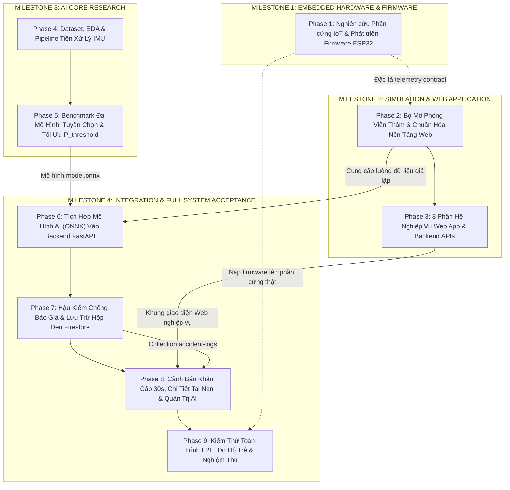

# Kế Hoạch Triển Khai Toàn Diện Hệ Thống (Master Implementation Plan)
## Dự Án: Hệ Thống An Toàn Xe Máy IoT (SmartBike)

> **Ghi chú**: Tài liệu này đóng vai trò là **Technical Implementation Plan** chuẩn mực cho toàn bộ dự án, phục vụ công tác quản lý, điều phối và phân chia đầu việc cho các thành viên trong đội ngũ phát triển.

---

# MỤC LỤC

1. [Phần A: Tổng Quan Roadmap & Biểu Đồ Phụ Thuộc (Dependency Graph)](#phần-a-tổng-quan-roadmap--biểu-đồ-phụ-thuộc)
2. [Phần B: Kế Hoạch Triển Khai Chi Tiết Từng Phase (Phase 1 – Phase 9)](#phần-b-kế-hoạch-triển-khai-chi-tiết-từng-phase)
   - [MILESTONE 1: EMBEDDED HARDWARE & FIRMWARE](#milestone-1-embedded-hardware--firmware)
     - [Phase 1: Nghiên Cứu Phần Cứng IoT & Phát Triển Firmware ESP32](#phase-1-nghiên-cứu-phần-cứng-iot--phát-triển-firmware-esp32)
   - [MILESTONE 2: SIMULATION & WEB APPLICATION](#milestone-2-simulation--web-application)
     - [Phase 2: Xây Dựng Bộ Mô Phỏng Viễn Thám & Chuẩn Hóa Nền Tảng Web](#phase-2-xây-dựng-bộ-mô-phỏng-viễn-thám--chuẩn-hóa-nền-tảng-web)
     - [Phase 3: Triển Khai 8 Phân Hệ Nghiệp Vụ Web App & Backend APIs](#phase-3-triển-khai-8-phân-hệ-nghiệp-vụ-web-app--backend-apis)
   - [MILESTONE 3: AI CORE RESEARCH](#milestone-3-ai-core-research)
     - [Phase 4: Khảo Sát Dataset, EDA & Pipeline Tiền Xử Lý Tín Hiệu IMU](#phase-4-khảo-sát-dataset-eda--pipeline-tiền-xử-lý-tín-hiệu-imu)
     - [Phase 5: Benchmark Đa Mô Hình, Tuyển Chọn & Tối Ưu Hóa Ngưỡng P_threshold](#phase-5-benchmark-đa-mô-hình-tuyển-chọn--tối-ưu-hóa-ngưỡng-p_threshold)
   - [MILESTONE 4: INTEGRATION & FULL SYSTEM ACCEPTANCE](#milestone-4-integration--full-system-acceptance)
     - [Phase 6: Tích Hợp Mô Hình AI (ONNX) Vào Backend FastAPI](#phase-6-tích-hợp-mô-hình-ai-onnx-vào-backend-fastapi)
     - [Phase 7: Hậu Kiểm Chống Báo Giả & Lưu Trữ Hộp Đen Firestore](#phase-7-hậu-kiểm-chống-báo-giả--lưu-trữ-hộp-đen-firestore)
     - [Phase 8: Cảnh Báo Khẩn Cấp 30s, Chi Tiết Tai Nạn & Quản Trị AI](#phase-8-cảnh-báo-khẩn-cấp-30s-chi-tiết-tai-nạn--quản-trị-ai)
     - [Phase 9: Kiểm Thử Toàn Trình E2E, Đo Độ Trễ & Nghiệm Thu Hệ Thống](#phase-9-kiểm-thử-toàn-trình-e2e-đo-độ-trễ--nghiệm-thu-hệ-thống)
3. [Phần C: Ma Trận Tác Động Tệp Tin (File Impact Matrix)](#phần-c-ma-trận-tác-động-tệp-tin-file-impact-matrix)
4. [Phần D: Bảng Phân Rã Công Việc Cho Đội Ngũ (Task Breakdown)](#phần-d-bảng-phân-rã-công-việc-cho-đội-ngũ)
5. [Phần E: Tiêu Chí Nghiệm Thu Từng Phase (Acceptance Criteria)](#phần-e-tiêu-chí-nghiệm-thu-từng-phase)
6. [Phần F: Chiến Lược Kiểm Thử Toàn Hệ Thống (Testing Strategy)](#phần-f-chiến-lược-kiểm-thử-toàn-hệ-thống)
7. [Phần G: Danh Mục Điểm Mở Cần Quyết Định (TBD & Open Decisions)](#phần-g-danh-mục-điểm-mở-cần-quyết-định)

---

# PHẦN A: TỔNG QUAN ROADMAP & BIỂU ĐỒ PHỤ THUỘC

## 1. Cấu Trúc Phân Tầng Dự Án

```
HỆ THỐNG AN TOÀN XE MÁY THÔNG MINH IOT (SMARTBIKE)
│
├── MILESTONE 1: EMBEDDED HARDWARE & FIRMWARE (Phần Cứng & Mã Nguồn Nhúng)
│   └── Phase 1: Nghiên Cứu Phần Cứng IoT & Phát Triển Firmware ESP32
│
├── MILESTONE 2: SIMULATION & WEB APPLICATION (Bộ Mô Phỏng & Ứng Dụng Web)
│   ├── Phase 2: Xây Dựng Bộ Mô Phỏng Viễn Thám & Chuẩn Hóa Nền Tảng Web
│   └── Phase 3: Triển Khai 8 Phân Hệ Nghiệp Vụ Web App & Backend APIs
│
├── MILESTONE 3: AI CORE RESEARCH (Nghiên Cứu & Tuyển Chọn Mô Hình AI)
│   ├── Phase 4: Khảo Sát Dataset, EDA & Pipeline Tiền Xử Lý Tín Hiệu IMU
│   └── Phase 5: Benchmark Đa Mô Hình, Tuyển Chọn & Tối Ưu Hóa Ngưỡng P_threshold
│
└── MILESTONE 4: INTEGRATION & FULL SYSTEM ACCEPTANCE (Hợp Nhất Toàn Trình & Nghiệm Thu)
    ├── Phase 6: Tích Hợp Mô Hình AI (ONNX) Vào Backend FastAPI
    ├── Phase 7: Hậu Kiểm Chống Báo Giả & Lưu Trữ Hộp Đen Firestore
    ├── Phase 8: Cảnh Báo Khẩn Cấp 30s, Chi Tiết Tai Nạn & Quản Trị AI
    └── Phase 9: Kiểm Thử Toàn Trình E2E, Đo Độ Trễ & Nghiệm Thu Hệ Thống
```

## 2. Biểu Đồ Phụ Thuộc Giữa Các Phase (Dependency Graph)



---

# PHẦN B: KẾ HOẠCH TRIỂN KHAI CHI TIẾT TỪNG PHASE

## MILESTONE 1: EMBEDDED HARDWARE & FIRMWARE

### Phase 1: Nghiên Cứu Phần Cứng IoT & Phát Triển Firmware ESP32

- **Mục tiêu (Objective)**:
  - Khảo sát sơ đồ nguyên lý mạch điện phần cứng từ tài liệu đồ án: ESP32, MPU6050 (I2C), GPS NEO-7M (UART2), SIM7020C NB-IoT (UART), còi C1815 (GPIO 14), cầu phân áp pin $10\text{k}\Omega/2\text{k}\Omega$ (GPIO 35).
  - Xây dựng hoàn chỉnh mã nguồn Firmware FreeRTOS đa nhiệm trên ESP32 đọc cảm biến 100Hz, phân tích cú pháp NMEA GPS, đo điện áp pin và gửi gói viễn thám JSON qua SIM7020C NB-IoT.
  - Triển khai Watchdog Timer và bộ đệm ngoại tuyến Flash SPIFFS (store-and-forward) chống mất mát dữ liệu khi xe đi vào vùng mất sóng.
- **Sự phụ thuộc (Dependencies)**: Không phụ thuộc (khởi chạy ngay từ ngày đầu tiên).
- **Phương pháp thực hiện (Implementation Approach)**:
  - Cấu hình dự án PlatformIO / ESP-IDF cho ESP32.
  - Viết Driver I2C đọc MPU6050 chu kỳ 10ms (100Hz), lọc thông thấp DLPF loại bỏ rung động máy.
  - Viết Driver UART2 phân tích bản tin NMEA `$GPRMC` lấy tọa độ và vận tốc $v_{GPS}$.
  - Viết Client điều khiển modem SIM7020C bằng AT commands (`AT+CSQ`, `AT+CGATT=1`, `AT+CHTTPCREATE`, `AT+CHTTPSEND`).
  - Đóng gói dữ liệu thành mảng mẫu JSON chuẩn viễn thám (Telemetry Contract).
- **Tệp tin tạo mới (Files to Create)**:
  - `docs/hardware_schematic.md`: Sơ đồ nguyên lý và bảng chân kết nối.
  - `firmware/smartbike_esp32/platformio.ini`: Cấu hình biên dịch PlatformIO.
  - `firmware/smartbike_esp32/include/config.h`: Khai báo chân GPIO, baudrate, server URL.
  - `firmware/smartbike_esp32/src/main.cpp`: Khởi tạo FreeRTOS tasks và vòng lặp.
  - `firmware/smartbike_esp32/src/mpu6050_driver.cpp` / `.h`: Driver I2C MPU6050 100Hz.
  - `firmware/smartbike_esp32/src/gps_parser.cpp` / `.h`: Parser NMEA GPS.
  - `firmware/smartbike_esp32/src/nbiot_client.cpp` / `.h`: Client điều khiển SIM7020C.
  - `firmware/smartbike_esp32/src/offline_buffer.cpp` / `.h`: Bộ nhớ đệm Flash SPIFFS.
  - `firmware/smartbike_esp32/src/power_manager.cpp` / `.h`: Đo ADC pin và quản lý nguồn.
- **Tiêu chuẩn nghiệm thu (Acceptance Criteria)**:
  - Firmware biên dịch thành công, nạp vào ESP32 chạy ổn định.
  - Giao tiếp I2C đọc liên tục 100Hz không nghẽn bus; GPS nhận tín hiệu định vị; SIM7020C gửi HTTP POST thành công qua mạng di động Viettel.
  - Mất sóng mạng: Dữ liệu tự động lưu vào Flash SPIFFS, khi có mạng tự gửi bù.
- **Yêu cầu kiểm thử (Testing Requirements)**:
  - Kiểm thử phần cứng HIL (Hardware-in-the-Loop), đo điện áp pin qua ADC, kiểm tra ngắt kết nối mạng giả lập.

---

## MILESTONE 2: SIMULATION & WEB APPLICATION

### Phase 2: Xây Dựng Bộ Mô Phỏng Viễn Thám & Chuẩn Hóa Nền Tảng Web

- **Mục tiêu (Objective)**:
  - Xây dựng script giả lập thiết bị IoT (`tools/device_simulator.py`) phát gói viễn thám chuẩn JSON qua HTTP phục vụ kiểm thử song song luồng Backend, AI và Web mà không phụ thuộc vào thiết bị vật lý.
  - Rà soát và gỡ bỏ triệt để các tàn dư của ứng dụng di động Flutter/Android/iOS.
  - Hoàn thiện 6 tệp tin rỗng 0-byte trong `frontend/src/` và chuẩn hóa cấu hình Vite proxy, Docker Compose.
- **Sự phụ thuộc (Dependencies)**: Phase 1 (kế thừa đặc tả Telemetry Contract).
- **Phương pháp thực hiện (Implementation Approach)**:
  - Viết script Python `tools/device_simulator.py` mô phỏng 6 kịch bản thực tế (Lái bình thường, Gờ giảm tốc, Phanh gấp, Ngã xe thật, Dắt trộm, Mất mạng).
  - Hoàn thiện 6 tệp rỗng: `accidentService.js`, `sensorService.js`, `useDevice.js`, `useNotifications.js`, `useVehicle.js`, `NotificationContext.jsx`.
  - Cấu hình Vite reverse proxy chuyển tiếp các request `/api/v1` sang backend `http://localhost:8000`.
- **Tệp tin tạo mới (Files to Create)**:
  - `tools/device_simulator.py`: Công cụ giả lập viễn thám thiết bị.
  - `tools/scenarios/normal_driving.json`, `speed_bump.json`, `hard_braking.json`, `crash_fall.json`.
- **Tệp tin cần chỉnh sửa (Files to Modify)**:
  - 6 tệp tin rỗng trong `frontend/src/`.
  - `frontend/vite.config.js`: Cấu hình proxy.
  - `docker-compose.yml`: Đồng bộ network giữa frontend và backend.
- **Tiêu chuẩn nghiệm thu (Acceptance Criteria)**:
  - Simulator phát dữ liệu định kỳ 50Hz mượt mà.
  - Web App khởi động không lỗi console, gọi API backend qua proxy thành công.
  - Lệnh `docker compose up --build` mở được cả Web App và Swagger UI API.

---

### Phase 3: Triển Khai 8 Phân Hệ Nghiệp Vụ Web App & Backend APIs

- **Mục tiêu (Objective)**: Xây dựng hoàn chỉnh 8 phân hệ nghiệp vụ trên Web App và các API Backend tương ứng.
- **Sự phụ thuộc (Dependencies)**: Phase 2 hoàn tất.
- **Nội dung 8 Phân hệ**:
  1. *Authentication*: Đăng ký, đăng nhập JWT, hồ sơ cá nhân, upload avatar Cloudinary, cấu hình danh bạ 3 số SOS khẩn cấp.
  2. *Dashboard*: Thẻ trạng thái xe, mức pin, toggle bật/tắt chế độ chống trộm `anti_thief`.
  3. *Vehicle Management*: Quản lý thông tin xe máy (hãng xe, dòng xe, màu sắc, biển số).
  4. *Device Management*: Liên kết thiết bị qua mã xác thực + mã PIN bảo mật, hủy liên kết.
  5. *Sensor Monitoring*: Biểu đồ trực quan hóa dữ liệu cảm biến thời gian thực.
  6. *GPS / Map*: Bản đồ số Leaflet định vị xe thời gian thực, nút yêu cầu gửi vị trí tức thời.
  7. *Accident History*: Danh sách các sự cố tai nạn theo thời gian, bộ lọc tìm kiếm.
  8. *Notification Center*: Dropdown chuông thông báo, badge đếm tin chưa đọc, đánh dấu đã đọc.
- **Tiêu chuẩn nghiệm thu (Acceptance Criteria)**:
  - Người dùng thao tác đầy đủ 8 luồng nghiệp vụ trên Web App mà không phát sinh lỗi HTTP 500 hoặc crash giao diện.
  - Dữ liệu phản ánh chính xác trong Google Cloud Firestore.

---

## MILESTONE 3: AI CORE RESEARCH

### Phase 4: Khảo Sát Dataset, EDA & Pipeline Tiền Xử Lý Tín Hiệu IMU

- **Mục tiêu (Objective)**:
  - Khảo sát và chuẩn hóa tập dữ liệu cảm biến quán tính 6 trục (IMU) bao gồm tai nạn thật, ngã xe và các tình huống giao thông bình thường (đường xóc, gờ giảm tốc, ổ gà, phanh gấp).
  - Phân tích khám phá dữ liệu (EDA): Phổ tần số FFT, phân phối gia tốc, độ lệch chuẩn.
  - Xây dựng pipeline tiền xử lý: Lọc nhiễu, chuẩn hóa `StandardScaler`, cơ chế cửa sổ trượt (Sliding Window 1-2s gối đầu 50%).
- **Sự phụ thuộc (Dependencies)**: Độc lập với Milestone 2 (có thể chạy song song).
- **Tệp tin tạo mới (Files to Create)**:
  - `ai_research/notebooks/01_dataset_eda.ipynb`: Phân tích khám phá dữ liệu.
  - `ai_research/src/preprocessing.py`: Module làm sạch và chuẩn hóa tín hiệu.
  - `ai_research/src/windowing.py`: Phân đoạn chuỗi tín hiệu thành cửa sổ trượt.
- **Tiêu chuẩn nghiệm thu (Acceptance Criteria)**:
  - Báo cáo EDA chỉ rõ đặc trưng phân biệt giữa va chạm thật và rung chấn mặt đường.
  - Pipeline tiền xử lý xuất ra ma trận cửa sổ trượt sẵn sàng cho các mô hình học máy.

---

### Phase 5: Benchmark Đa Mô Hình, Tuyển Chọn & Tối Ưu Hóa Ngưỡng $P_{threshold}$

- **Mục tiêu (Objective)**:
  - Xây dựng mô hình đường cơ sở (Baseline Model: Decision Tree / Logistic Regression).
  - Thử nghiệm đánh giá công bằng các mô hình ứng viên thuộc 2 nhóm: Machine Learning cổ điển (LightGBM, XGBoost, Random Forest) và Deep Learning (1D-CNN, GRU, LSTM, CNN-LSTM).
  - Đánh giá định lượng toàn diện bằng: Recall, Precision, F1-Score, PR-AUC, dung lượng mô hình và thời gian suy luận (Latency CPU).
  - Tuyển chọn 1 mô hình tốt nhất đáp ứng cân bằng giữa khả năng nhận diện và độ trễ.
  - Tối ưu hóa ngưỡng quyết định $P_{threshold}$ trên xác suất $P(\text{ACCIDENT})$ dựa trên kết quả thực nghiệm và sự đánh đổi giữa Recall và Precision.
  - Xuất mô hình chiến thắng sang định dạng chuẩn ONNX (`model.onnx`).
- **Sự phụ thuộc (Dependencies)**: Phase 4 hoàn tất.
- **Tệp tin tạo mới (Files to Create)**:
  - `ai_research/src/baseline.py`, `train_trees.py`, `train_deep.py`.
  - `ai_research/reports/BENCHMARK.md`: Báo cáo đối sánh định lượng các mô hình.
  - `ai_research/reports/SELECTION.md`: Báo cáo luận giải lựa chọn mô hình và ngưỡng $P_{threshold}$.
  - `ai_research/exported/model.onnx`: Tệp trọng số mô hình tối ưu.
- **Tiêu chuẩn nghiệm thu (Acceptance Criteria)**:
  - Có bảng so sánh định lượng minh bạch giữa tất cả các mô hình ứng viên trên cùng tập test độc lập.
  - Báo cáo chỉ rõ căn cứ lựa chọn khoảng tối ưu cho $P_{threshold}$ từ đường cong Precision-Recall.
  - File `.onnx` xuất xưởng chạy suy luận độc lập trên CPU mà không cần GPU.

---

## MILESTONE 4: INTEGRATION & FULL SYSTEM ACCEPTANCE

### Phase 6: Tích Hợp Mô Hình AI (ONNX) Vào Backend FastAPI

- **Mục tiêu (Objective)**:
  - Nhúng runtime ONNX vào Backend FastAPI sử dụng `onnxruntime` trên CPU.
  - Xây dựng module `ai_service.py` hỗ trợ tải trước mô hình (pre-load) khi khởi động máy chủ (`lifespan`).
  - Xây dựng endpoint tiếp nhận viễn thám `POST /api/v1/devices/{id}/telemetry` tiếp nhận mảng 50-100 mẫu cảm biến thô để đưa vào pipeline suy luận.
  - Xác thực thời gian suy luận (Inference Latency) đạt tiêu chuẩn thời gian thực ($< 50\text{ms}$).
- **Sự phụ thuộc (Dependencies)**: Phase 5 (mô hình ONNX) và Phase 2 (Simulator) hoàn tất.
- **Tệp tin tạo mới & chỉnh sửa**:
  - `backend/requirements.txt`: Thêm `onnxruntime>=1.18.0`.
  - `backend/app/ai/model.onnx`: Trọng số mô hình.
  - `backend/app/service/ai_service.py`: Dịch vụ nạp session ONNX và suy luận.
  - `backend/app/dto/telemetry_dto.py`: Schema tiếp nhận gói dữ liệu viễn thám.
  - `backend/app/controller/device_controller.py`: Thêm endpoint `/telemetry`.
- **Tiêu chuẩn nghiệm thu (Acceptance Criteria)**:
  - Gửi gói viễn thám thử nghiệm qua Swagger UI, API trả về xác suất $P(\text{ACCIDENT})$ chính xác với độ trễ $< 50\text{ms}$.

---

### Phase 7: Hậu Kiểm Chống Báo Giả & Lưu Trữ Hộp Đen Firestore

- **Mục tiêu (Objective)**:
  - Triển khai thuật toán hậu kiểm trạng thái xe: Kiểm tra góc nghiêng ngã xe ($\theta \ge 60^\circ$) và vận tốc dừng ($v \approx 0$) trong 1.5s kế tiếp sau va chạm để triệt tiêu báo động giả do xóc nảy mặt đường (gờ giảm tốc, sụp ổ gà).
  - Triển khai cơ chế làm mượt xác suất theo thời gian (Temporal Debounce / Sliding Window Consensus).
  - Thiết kế cấu trúc lưu trữ hộp đen `accident-logs` trong Cloud Firestore, tự động lưu vết toàn bộ bản chụp 50-100 mẫu cảm biến thô, xác suất AI, góc nghiêng và tọa độ GPS.
  - Kết nối tự động tạo thông báo khẩn cấp trong `user-notifications`.
- **Sự phụ thuộc (Dependencies)**: Phase 6 hoàn tất.
- **Tệp tin tạo mới & chỉnh sửa**:
  - `backend/app/entity/accident_log.py`, `backend/app/dto/accident_dto.py`.
  - `backend/app/service/device_service.py`: Tích hợp logic hậu kiểm góc nghiêng và lưu nhật ký hộp đen.
  - `backend/app/service/notification_service.py`: Sinh thông báo khẩn cấp liên kết mã sự cố.
- **Tiêu chuẩn nghiệm thu (Acceptance Criteria)**:
  - Gói tin va chạm kèm xe đổ $\ge 60^\circ$: Tạo bản ghi `CONFIRMED` trong `accident-logs` và gửi thông báo.
  - Gói tin xung giật ổ gà nhưng xe thẳng $< 25^\circ$: Ghi nhận `SUPPRESSED_FALSE_ALARM`, không báo động sai.

---

### Phase 8: Cảnh Báo Khẩn Cấp 30s, Chi Tiết Tai Nạn & Quản Trị AI

- **Mục tiêu (Objective)**:
  - Xây dựng giao diện cảnh báo khẩn cấp toàn màn hình trên Web App với viền đỏ nhấp nháy, âm thanh còi hú báo động và bộ đếm lùi 30 giây kèm nút **"Tôi an toàn / Hủy báo động"** (`PUT /api/v1/accidents/{id}/cancel`). Hết 30 giây tự động chuyển sang chế độ gọi SOS.
  - Nâng cấp trang Chi tiết tai nạn (`AccidentDetail.jsx`) hiển thị bản đồ Leaflet phóng to, thẻ chỉ số AI ($P$, gia tốc đỉnh, góc nghiêng) và biểu đồ sóng SVG trực quan hóa mảng mẫu cảm biến thô từ hộp đen.
  - Nâng cấp trang Quản trị viên (`AdminSettings.jsx`) cho phép cấu hình động ngưỡng quyết định $P_{threshold}$, thời gian đếm lùi và hiển thị phiên bản mô hình AI.
- **Sự phụ thuộc (Dependencies)**: Phase 3 và Phase 7 hoàn tất.
- **Tệp tin tạo mới & chỉnh sửa**:
  - `frontend/src/components/layout/AlertPopup.jsx`: Giao diện khẩn cấp & countdown 30s.
  - `frontend/src/pages/user/accident/AccidentDetail.jsx`: Chỉ số AI & biểu đồ sóng hộp đen SVG.
  - `frontend/src/pages/admin/settings/AdminSettings.jsx`: Bảng điều khiển cấu hình $P_{threshold}$ động.
  - `backend/app/controller/accident_controller.py`: APIs hủy cảnh báo và cấu hình AI.
- **Tiêu chuẩn nghiệm thu (Acceptance Criteria)**:
  - Khi có sự cố tai nạn, modal cảnh báo bật tức thời kèm còi hú; bấm "Tôi an toàn" hủy cảnh báo thành công.
  - Admin tinh chỉnh $P_{threshold}$ trên Web, Backend áp dụng ngay lập tức mà không cần khởi động lại.

---

### Phase 9: Kiểm Thử Toàn Trình E2E, Đo Độ Trễ & Nghiệm Thu Hệ Thống

- **Mục tiêu (Objective)**:
  - Thực hiện kiểm thử tích hợp toàn trình (End-to-End System Testing) từ khâu phát viễn thám $\rightarrow$ Backend suy luận AI $\rightarrow$ Hậu kiểm $\rightarrow$ Firestore $\rightarrow$ Web App hiển thị cảnh báo.
  - Kiểm chứng 4 kịch bản viễn thám thực tế: Va chạm ngã xe thật, Gờ giảm tốc/Ổ gà, Phanh gấp, Dắt trộm xe.
  - Đo lường và kiểm chứng độ trễ toàn trình (E2E Latency) đạt $< 500\text{ms}$.
  - Xác nhận toàn bộ hệ thống khởi chạy trơn tru với 1 lệnh `docker compose up --build`.
  - Xuất bản Báo cáo Nghiệm thu Toàn diện Hệ thống (`SYSTEM_VERIFICATION_REPORT.md`).
- **Sự phụ thuộc (Dependencies)**: Toàn bộ Phase 1 đến Phase 8 hoàn tất.
- **Tệp tin tạo mới (Files to Create)**:
  - `tests/e2e/test_e2e_pipeline.py`: Script kiểm thử tự động toàn trình.
  - `tests/e2e/benchmark_latency.py`: Công cụ đo lường độ trễ từng chặng.
  - `docs/SYSTEM_VERIFICATION_REPORT.md`: Báo cáo kết quả nghiệm thu toàn hệ thống.
- **Tiêu chuẩn nghiệm thu (Acceptance Criteria)**:
  - 100% kịch bản kiểm thử phản hồi đúng logic mong đợi; không có báo động giả trong kịch bản gờ giảm tốc và phanh gấp.
  - Tổng độ trễ toàn trình đạt $< 500\text{ms}$; hệ sinh thái Docker khởi chạy thành công trên máy sạch.

---

# PHẦN C: MA TRẬN TÁC ĐỘNG TỆP TIN (FILE IMPACT MATRIX)

| Tệp Tin / Thư Mục | Phân Hệ | Thao Tác | Phase Ảnh Hưởng | Mục Đích Thay Đổi |
| :--- | :--- | :---: | :---: | :--- |
| `docs/hardware_schematic.md` | Hardware (A) | **NEW** | Phase 1 | Lập tài liệu sơ đồ mạch điện và kết nối chân ESP32 |
| `firmware/smartbike_esp32/` | Firmware (B) | **NEW** | Phase 1 | Toàn bộ mã nguồn nhúng FreeRTOS ESP32, MPU6050, GPS, SIM7020C |
| `tools/device_simulator.py` | Simulator (C) | **NEW** | Phase 2 | Bộ mô phỏng phát gói viễn thám cảm biến đa chiều qua HTTP |
| `frontend/src/services/accidentService.js` | Web (G) | **NEW/MODIFY**| Phase 2, 8 | Xây dựng API client truy vấn sự cố tai nạn và hủy cảnh báo |
| `frontend/src/services/sensorService.js` | Web (G) | **NEW/MODIFY**| Phase 2, 3 | Xây dựng API client lấy dữ liệu viễn thám cảm biến |
| `frontend/src/hooks/useDevice.js` | Web (G) | **NEW/MODIFY**| Phase 2, 3 | Hook quản lý trạng thái thiết bị và danh sách xe |
| `frontend/src/hooks/useNotifications.js` | Web (G) | **NEW/MODIFY**| Phase 2, 3 | Hook quản lý hộp thư thông báo và đếm tin chưa đọc |
| `frontend/src/hooks/useVehicle.js` | Web (G) | **NEW/MODIFY**| Phase 2, 3 | Hook quản lý thông tin phương tiện người dùng |
| `frontend/src/context/NotificationContext.jsx`| Web (G) | **NEW/MODIFY**| Phase 2, 3 | Context quản lý thông báo toàn cục và lắng nghe sự cố khẩn cấp |
| `ai_research/notebooks/` | AI / ML (F) | **NEW** | Phase 4 | Notebooks phân tích khám phá dữ liệu EDA và phổ tần số |
| `ai_research/src/` | AI / ML (F) | **NEW** | Phase 4, 5 | Scripts tiền xử lý, sliding window, huấn luyện và benchmark |
| `backend/app/ai/model.onnx` | AI / BE (F, D)| **NEW** | Phase 5, 6 | Tệp trọng số mô hình AI tối ưu cho suy luận CPU |
| `backend/requirements.txt` | Backend (D) | **MODIFY** | Phase 6 | Bổ sung `onnxruntime` và `numpy` |
| `backend/app/service/ai_service.py` | Backend (D) | **NEW** | Phase 6 | Dịch vụ nạp session ONNX và thực thi inference $< 50\text{ms}$ |
| `backend/app/dto/telemetry_dto.py` | Backend (D) | **NEW** | Phase 6 | Pydantic Schema tiếp nhận gói viễn thám cảm biến đa chiều |
| `backend/app/controller/device_controller.py`| Backend (D) | **MODIFY** | Phase 6 | Bổ sung endpoint `POST /api/v1/devices/{id}/telemetry` |
| `backend/app/entity/accident_log.py` | Database (E) | **NEW** | Phase 7 | Entity đại diện cho collection hộp đen `accident-logs` |
| `backend/app/service/device_service.py` | Backend (D) | **MODIFY** | Phase 7 | Logic hậu kiểm góc nghiêng ngã xe và ghi nhật ký hộp đen |
| `frontend/src/components/layout/AlertPopup.jsx`| Web (G, H) | **MODIFY** | Phase 8 | Modal cảnh báo đỏ toàn màn hình, còi hú và countdown 30s |
| `frontend/src/pages/user/accident/AccidentDetail.jsx`| Web (G) | **MODIFY** | Phase 8 | Nâng cấp bản đồ, thẻ chỉ số AI và biểu đồ sóng hộp đen SVG |
| `frontend/src/pages/admin/settings/AdminSettings.jsx`| Web (G) | **MODIFY** | Phase 8 | Chuyển đổi sang bảng cấu hình động tham số AI $P_{threshold}$ |
| `tests/e2e/test_e2e_pipeline.py` | Testing (J) | **NEW** | Phase 9 | Kịch bản kiểm thử tích hợp tự động toàn trình 4 tình huống |
| `docs/SYSTEM_VERIFICATION_REPORT.md` | Docs (K) | **NEW** | Phase 9 | Báo cáo nghiệm thu kỹ thuật toàn diện hệ thống |

---

# PHẦN D: BẢNG PHÂN RÃ CÔNG VIỆC CHO ĐỘI NGŨ (TASK BREAKDOWN)

Dưới đây là danh mục chi tiết **36 nhiệm vụ nguyên tử (Atomic Tasks)** được phân bổ theo 9 Phases, có chỉ định rõ vai trò chuyên môn phụ trách, tệp tin tác động, quan hệ phụ thuộc và tiêu chí nghiệm thu để người quản lý dự án có thể phân công trực tiếp cho từng thành viên:

### Phase 1: Nghiên Cứu Phần Cứng IoT & Phát Triển Firmware ESP32
*Vai trò chính phụ trách: Kỹ sư Phần cứng & Lập trình Nhúng (Embedded / IoT Hardware Engineer)*

| Task ID | Vai Trò Phụ Trách | Tên Nhiệm Vụ & Mô Tả Chi Tiết | Trạng Thái | Tệp Tin / Module Ảnh Hưởng | Phụ Thuộc | Tiêu Chuẩn Nghiệm Thu Chi Tiết |
| :--- | :--- | :--- | :---: | :--- | :---: | :--- |
| **TSK-101** | Embedded / HW | Khảo sát & tài liệu hóa sơ đồ chân GPIO ESP32, MPU6050, GPS, SIM7020C, còi C1815, cầu phân áp pin | EXISTING DOCS | `docs/hardware_schematic.md` | Không | Sơ đồ đối chiếu khớp 100% tài liệu luận văn và bảng kết nối chân pinout thực tế |
| **TSK-102** | Embedded / FW | Khởi tạo cấu trúc dự án Firmware FreeRTOS đa nhiệm 2 nhân (PlatformIO / ESP-IDF) | NEW | `firmware/smartbike_esp32/platformio.ini`, `src/main.cpp` | TSK-101 | Dự án biên dịch thành công, nạp được vào board ESP32 không phát sinh lỗi cảnh báo |
| **TSK-103** | Embedded / FW | Viết module Driver I2C đọc MPU6050 6 trục chu kỳ 10ms (100Hz), kích hoạt lọc phần cứng DLPF | NEW | `firmware/smartbike_esp32/src/mpu6050_driver.cpp` | TSK-102 | Đọc chính xác $a_x, a_y, a_z, \omega_x, \omega_y, \omega_z$ liên tục 100Hz đẩy vào Ring Buffer không treo I2C |
| **TSK-104** | Embedded / FW | Viết module Parser UART2 đọc và phân tách bản tin NMEA GPS U-blox NEO-7M | NEW | `firmware/smartbike_esp32/src/gps_parser.cpp` | TSK-102 | Tách thành công kinh độ, vĩ độ, thời gian UTC và vận tốc tức thời $v_{GPS}$ từ bản tin `$GPRMC` |
| **TSK-105** | Embedded / FW | Viết module Quản lý nguồn & Đo điện áp pin qua ADC GPIO 35 (Cầu phân áp $10\text{k}\Omega / 2\text{k}\Omega$) | NEW | `firmware/smartbike_esp32/src/power_manager.cpp` | TSK-102 | Đọc giá trị ADC, quy đổi chính xác điện áp pin 2S (6.4V - 8.4V) và tính phần trăm pin |
| **TSK-106** | Embedded / FW | Viết module AT Client SIM7020C kết nối mạng NB-IoT Viettel và gửi HTTP POST telemetry | NEW | `firmware/smartbike_esp32/src/nbiot_client.cpp` | TSK-103, TSK-104 | Đóng gói JSON viễn thám chu kỳ 20ms (50Hz), gửi thành công tới Backend qua SIM7020C |
| **TSK-107** | Embedded / FW | Triển khai Watchdog Timer (WDT 10s) và Bộ đệm Flash SPIFFS lưu ngoại tuyến (Store-and-forward) | NEW | `firmware/smartbike_esp32/src/offline_buffer.cpp` | TSK-106 | Thiết bị mất mạng tự động lưu tối đa 200 gói vào SPIFFS; có sóng tự động gửi bù về máy chủ |
| **TSK-108** | QA / Embedded | Kiểm thử tích hợp phần cứng HIL Test (Đo dòng tiêu thụ, kiểm tra kết nối mạng 24h) | NEW | `firmware/tests/test_hardware.cpp` | TSK-103 - TSK-107 | Hệ thống vận hành liên tục 24 giờ không bị rò rỉ bộ nhớ, không khởi động lại ngoài ý muốn |

---

### Phase 2: Xây Dựng Bộ Mô Phỏng Viễn Thám & Chuẩn Hóa Nền Tảng Web
*Vai trò chính phụ trách: Kỹ sư QA/Mô Phỏng & Kỹ sư Frontend Web*

| Task ID | Vai Trò Phụ Trách | Tên Nhiệm Vụ & Mô Tả Chi Tiết | Trạng Thái | Tệp Tin / Module Ảnh Hưởng | Phụ Thuộc | Tiêu Chuẩn Nghiệm Thu Chi Tiết |
| :--- | :--- | :--- | :---: | :--- | :---: | :--- |
| **TSK-201** | QA / Simulator | Viết script Python `tools/device_simulator.py` phát gói viễn thám chuẩn JSON qua HTTP | NEW | `tools/device_simulator.py` | TSK-106 (Contract) | Script chạy độc lập qua CLI, phát gói tin 50Hz đúng định dạng Telemetry Contract |
| **TSK-202** | QA / Simulator | Tích hợp 6 kịch bản viễn thám (Lái bình thường, Gờ giảm tốc, Phanh gấp, Ngã xe, Trộm, Offline) | NEW | `tools/scenarios/` | TSK-201 | Người dùng chọn kịch bản qua tham số `--scenario` và điều chỉnh tốc độ phát linh hoạt |
| **TSK-203** | Frontend Web | Rà soát và gỡ bỏ triệt để toàn bộ ghi chú, cấu hình, dependencies tàn dư Flutter/Mobile | MODIFY | `frontend/`, `README.md` | Không | Không còn bất kỳ tham chiếu hay tệp tin nào liên quan đến ứng dụng di động Flutter |
| **TSK-204** | Frontend Web | Hoàn thiện nội dung 6 tệp tin rỗng 0-byte (`accidentService.js`, `sensorService.js`, 3 hooks, context) | MODIFY | `frontend/src/services/`, `hooks/`, `context/` | Không | Các tệp có đầy đủ hàm API call và React hooks chuẩn, không gây lỗi import khi biên dịch |
| **TSK-205** | Web / DevOps | Chuẩn hóa cấu hình Vite reverse proxy (`/api/v1`) và kiểm tra thông luồng Docker Compose | MODIFY | `frontend/vite.config.js`, `docker-compose.yml` | TSK-204 | Lệnh `docker compose up --build` mở được Web App `localhost:5173` và Backend `localhost:8000` |

---

### Phase 3: Triển Khai 8 Phân Hệ Nghiệp Vụ Web App & Backend APIs
*Vai trò chính phụ trách: Kỹ sư Frontend Web & Kỹ sư Backend FastAPI*

| Task ID | Vai Trò Phụ Trách | Tên Nhiệm Vụ & Mô Tả Chi Tiết | Trạng Thái | Tệp Tin / Module Ảnh Hưởng | Phụ Thuộc | Tiêu Chuẩn Nghiệm Thu Chi Tiết |
| :--- | :--- | :--- | :---: | :--- | :---: | :--- |
| **TSK-301** | Frontend / Backend | Module 1: Luồng Xác thực (Đăng ký, Đăng nhập JWT, Profile, Avatar Cloudinary, 3 số SOS) | MODIFY | `Profile.jsx`, `auth_controller.py`, `user_service.py` | TSK-204 | Cập nhật được hồ sơ cá nhân và lưu mảng 3 số điện thoại SOS vào Firestore |
| **TSK-302** | Frontend / Backend | Module 2: Dashboard trung tâm hiển thị trạng thái xe, mức pin, toggle chống trộm `anti_thief` | MODIFY | `Dashboard.jsx`, `device_service.py` | TSK-301 | Gạt nút bật/tắt chống trộm cập nhật ngay lập tức trường `anti_thief` trong Firestore |
| **TSK-303** | Frontend / Backend | Module 3: Quản lý thông tin phương tiện (Hãng xe, dòng xe, màu sắc, biển số xe) | MODIFY | `Vehicle.jsx`, `device_dto.py` | TSK-302 | Form cập nhật thông tin xe máy hiển thị trực quan dạng Vehicle Card |
| **TSK-304** | Frontend / Backend | Module 4: Quản lý thiết bị IoT (Liên kết mã xác thực + PIN bảo mật, hủy liên kết) | MODIFY | `Device.jsx`, `device_controller.py` | TSK-302 | Nhập đúng `verification_code` và `secret_code` mới cho phép gán thiết bị vào tài khoản |
| **TSK-305** | Frontend / Backend | Module 5: Giám sát cảm biến viễn thám thời gian thực (Biểu đồ gia tốc và góc nghiêng) | MODIFY | `SensorData.jsx`, `sensorService.js` | TSK-204 | Chuyển đổi màn hình từ mock UI sang vẽ đồ thị dữ liệu cảm biến thời gian thực |
| **TSK-306** | Frontend / Backend | Module 6: Bản đồ số Leaflet định vị xe thời gian thực, nút yêu cầu gửi tọa độ tức thời | MODIFY | `Tracking.jsx`, `MapComponent.jsx` | TSK-304 | Ghim chính xác vị trí xe trên bản đồ vệ tinh/đường sá OpenStreetMap |
| **TSK-307** | Frontend / Backend | Module 7: Lịch sử sự cố tai nạn (Danh sách sự kiện, bộ lọc thời gian, trạng thái) | MODIFY | `AccidentHistory.jsx` | TSK-304 | Hiển thị bảng danh sách các sự cố từ database, cho phép lọc theo ngày và trạng thái |
| **TSK-308** | Frontend / Backend | Module 8: Trung tâm thông báo (Dropdown chuông, badge đếm tin chưa đọc, đánh dấu đã đọc) | MODIFY | `Header.jsx`, `NotificationContext.jsx` | TSK-204 | Huy hiệu hiển thị đúng số thông báo chưa đọc; bấm đánh dấu đọc sẽ cập nhật tức thời |

---

### Phase 4: Khảo Sát Dataset, EDA & Pipeline Tiền Xử Lý Tín Hiệu IMU
*Vai trò chính phụ trách: Kỹ sư AI & Khoa Học Dữ Liệu (AI / Data Science Engineer)*

| Task ID | Vai Trò Phụ Trách | Tên Nhiệm Vụ & Mô Tả Chi Tiết | Trạng Thái | Tệp Tin / Module Ảnh Hưởng | Phụ Thuộc | Tiêu Chuẩn Nghiệm Thu Chi Tiết |
| :--- | :--- | :--- | :---: | :--- | :---: | :--- |
| **TSK-401** | AI / Data Science | Thu thập và chuẩn hóa tập dữ liệu cảm biến IMU 6 trục (tai nạn thật vs lái xe bình thường) | NEW | `ai_research/data/` | Không | Bộ dữ liệu có đầy đủ 6 trục quán tính ($a_x, a_y, a_z, \omega_x, \omega_y, \omega_z$), nhãn rõ ràng |
| **TSK-402** | AI / Data Science | Phân tích khám phá dữ liệu (EDA): Phân bố gia tốc, phổ tần số FFT, xử lý mất cân bằng lớp | NEW | `ai_research/notebooks/01_eda.ipynb` | TSK-401 | Báo cáo trực quan hóa chứng minh đặc trưng phân biệt giữa va chạm và xóc mặt đường |
| **TSK-403** | AI / Data Science | Xây dựng pipeline tiền xử lý tín hiệu: Bộ lọc khử nhiễu, chuẩn hóa biên độ `StandardScaler` | NEW | `ai_research/src/preprocessing.py` | TSK-402 | Dữ liệu đầu vào được chuẩn hóa về phân phối chuẩn không có giá trị NaN hoặc Inf |
| **TSK-404** | AI / Data Science | Xây dựng cơ chế cửa sổ trượt (Sliding Window 1.0s - 2.0s, gối đầu 50%) trích xuất ma trận | NEW | `ai_research/src/windowing.py` | TSK-403 | Ma trận cửa sổ trượt xuất ra có kích thước cố định, giữ nguyên vẹn đỉnh va chạm |

---

### Phase 5: Benchmark Đa Mô Hình, Tuyển Chọn & Tối Ưu Hóa Ngưỡng $P_{threshold}$
*Vai trò chính phụ trách: Kỹ sư AI & Machine Learning*

| Task ID | Vai Trò Phụ Trách | Tên Nhiệm Vụ & Mô Tả Chi Tiết | Trạng Thái | Tệp Tin / Module Ảnh Hưởng | Phụ Thuộc | Tiêu Chuẩn Nghiệm Thu Chi Tiết |
| :--- | :--- | :--- | :---: | :--- | :---: | :--- |
| **TSK-501** | AI / Machine Learning | Xây dựng mô hình cơ sở (Baseline Model: Decision Tree / Logistic Regression) | NEW | `ai_research/src/baseline.py` | TSK-404 | Thiết lập mốc tham chiếu định lượng ban đầu về Recall, Precision và F1-Score |
| **TSK-502** | AI / Machine Learning | Thử nghiệm nhóm Tree-based: LightGBM, XGBoost, Random Forest (kết hợp trích xuất đặc trưng FFT) | NEW | `ai_research/src/train_trees.py` | TSK-404 | Huấn luyện và xuất ma trận nhầm lẫn (Confusion Matrix) trên tập validation |
| **TSK-503** | AI / Machine Learning | Thử nghiệm nhóm Deep Learning: 1D-CNN, GRU, LSTM, CNN-LSTM trên ma trận chuỗi thời gian | NEW | `ai_research/src/train_deep.py` | TSK-404 | Huấn luyện với cơ chế Early Stopping và Class Weights để xử lý lệch nhãn |
| **TSK-504** | AI / Machine Learning | Đánh giá so sánh định lượng (Recall, Precision, F1-Score, PR-AUC, dung lượng, Latency CPU) | NEW | `ai_research/reports/BENCHMARK.md` | TSK-502, TSK-503 | Bảng so chuẩn định lượng minh bạch giữa tất cả các mô hình ứng viên |
| **TSK-505** | AI / Machine Learning | Tuyển chọn mô hình tối ưu & xác định khoảng tối ưu cho ngưỡng quyết định $P_{threshold}$ | NEW | `ai_research/reports/SELECTION.md` | TSK-504 | Chọn ra 1 mô hình tối ưu; xác định khoảng $P_{threshold}$ dựa trên phân tích đánh đổi Recall vs Precision |
| **TSK-506** | AI / Machine Learning | Đóng gói mô hình chiến thắng và pipeline tiền xử lý sang định dạng chuẩn ONNX | NEW | `ai_research/exported/model.onnx` | TSK-505 | Tệp `model.onnx` hợp lệ, thực thi suy luận độc lập trên CPU không phụ thuộc framework gốc |

---

### Phase 6: Tích Hợp Mô Hình AI (ONNX) Vào Backend FastAPI
*Vai trò chính phụ trách: Kỹ sư Backend FastAPI & Kỹ sư AI Deployment*

| Task ID | Vai Trò Phụ Trách | Tên Nhiệm Vụ & Mô Tả Chi Tiết | Trạng Thái | Tệp Tin / Module Ảnh Hưởng | Phụ Thuộc | Tiêu Chuẩn Nghiệm Thu Chi Tiết |
| :--- | :--- | :--- | :---: | :--- | :---: | :--- |
| **TSK-601** | Backend Dev | Cài đặt `onnxruntime` và `numpy` vào cấu hình môi trường `backend/requirements.txt` | MODIFY | `backend/requirements.txt`, `Dockerfile` | Không | Cài đặt thư viện thành công trong container Python 3.11 không xung đột dependencies |
| **TSK-602** | Backend / AI | Xây dựng module `ai_service.py` quản lý ONNX InferenceSession (Pre-load tại lifespan) | NEW | `backend/app/service/ai_service.py` | TSK-506, TSK-601 | Session ONNX nạp sẵn sàng vào bộ nhớ máy chủ ngay khi khởi động FastAPI |
| **TSK-603** | Backend Dev | Định nghĩa Pydantic Schemas tiếp nhận gói dữ liệu viễn thám cảm biến đa chiều | NEW | `backend/app/dto/telemetry_dto.py` | Không | Schema kiểm tra chặt chẽ cấu trúc mảng IMU, tọa độ GPS và thông tin pin |
| **TSK-604** | Backend Dev | Xây dựng endpoint tiếp nhận viễn thám `POST /api/v1/devices/{id}/telemetry` | NEW | `backend/app/controller/device_controller.py` | TSK-602, TSK-603 | Endpoint nhận gói viễn thám, gọi AI suy luận trả về xác suất $P(\text{ACCIDENT})$ |
| **TSK-605** | QA / Testing | Viết unit test tự động đo độ trễ suy luận của AI Engine trên CPU máy chủ Backend | NEW | `tests/unit/test_ai_inference.py` | TSK-604 | Thời gian suy luận cho một cửa sổ trượt đạt $< 50\text{ ms}$ |

---

### Phase 7: Hậu Kiểm Chống Báo Giả & Lưu Trữ Hộp Đen Firestore
*Vai trò chính phụ trách: Kỹ sư Backend FastAPI & Kỹ sư Cơ Sở Dữ Liệu*

| Task ID | Vai Trò Phụ Trách | Tên Nhiệm Vụ & Mô Tả Chi Tiết | Trạng Thái | Tệp Tin / Module Ảnh Hưởng | Phụ Thuộc | Tiêu Chuẩn Nghiệm Thu Chi Tiết |
| :--- | :--- | :--- | :---: | :--- | :---: | :--- |
| **TSK-701** | Backend Dev | Triển khai thuật toán hậu kiểm góc nghiêng ngã xe ($\theta \ge 60^\circ$) và dừng xe ($v \approx 0$) | NEW | `backend/app/service/device_service.py` | TSK-604 | Phân biệt chính xác giữa ngã xe thật và xóc gờ giảm tốc/ổ gà mặt đường |
| **TSK-702** | Backend Dev | Triển khai cơ chế làm mượt xác suất theo thời gian (EMA / Window Consensus Debouncing) | NEW | `backend/app/service/device_service.py` | TSK-701 | Triệt tiêu các xung kích tức thời đơn lẻ do nhiễu cảm biến |
| **TSK-703** | Database Dev | Thiết kế Entity và DTO cho collection hộp đen `accident-logs` trong Firestore | NEW | `backend/app/entity/accident_log.py`, `accident_dto.py` | Không | Khai báo đầy đủ các trường: snapshot 100 mẫu thô, $P$, tilt angle, GPS, model version |
| **TSK-704** | Backend Dev | Xử lý lưu vết sự kiện: Tạo bản ghi `accident-logs` và kích hoạt `user-notifications` | MODIFY | `backend/app/service/notification_service.py` | TSK-702, TSK-703 | Sự cố va chạm xác nhận tự động sinh thông báo khẩn cấp gắn mã hộp đen liên kết |

---

### Phase 8: Cảnh Báo Khẩn Cấp 30s, Chi Tiết Tai Nạn & Quản Trị AI
*Vai trò chính phụ trách: Kỹ sư Frontend Web & Kỹ sư Backend FastAPI*

| Task ID | Vai Trò Phụ Trách | Tên Nhiệm Vụ & Mô Tả Chi Tiết | Trạng Thái | Tệp Tin / Module Ảnh Hưởng | Phụ Thuộc | Tiêu Chuẩn Nghiệm Thu Chi Tiết |
| :--- | :--- | :--- | :---: | :--- | :---: | :--- |
| **TSK-801** | Frontend Web | Xây dựng modal cảnh báo khẩn cấp toàn màn hình viền đỏ nhấp nháy kèm âm thanh còi hú | MODIFY | `frontend/src/components/layout/AlertPopup.jsx` | TSK-308 | Modal bật tức thời khi có thông báo loại `ACCIDENT`, phát âm thanh còi báo động lặp lại |
| **TSK-802** | Frontend Web | Tích hợp bộ đếm lùi 30 giây trực quan và nút bấm lớn **"Tôi an toàn / Hủy báo động"** | MODIFY | `AlertPopup.jsx`, `accidentService.js` | TSK-801 | Bấm nút hủy gửi lệnh cập nhật `CANCELLED_BY_USER`, tắt còi; hết 30s chuyển trạng thái SOS |
| **TSK-803** | Backend Dev | Xây dựng API tiếp nhận hủy cảnh báo `PUT /api/v1/accidents/{id}/cancel` | NEW | `backend/app/controller/accident_controller.py` | TSK-704 | Cập nhật trạng thái sự cố trong `accident-logs` thành công |
| **TSK-804** | Frontend Web | Nâng cấp trang Chi tiết tai nạn: Bản đồ vị trí phóng to, thẻ chỉ số AI ($P, g, \theta, v$) | MODIFY | `frontend/src/pages/user/accident/AccidentDetail.jsx` | TSK-703 | Hiển thị chi tiết tọa độ xảy ra va chạm và các thông số phân tích của mô hình AI |
| **TSK-805** | Frontend Web | Tích hợp biểu đồ sóng SVG trực quan hóa mảng mẫu cảm biến thô từ hộp đen | NEW | `AccidentDetail.jsx` | TSK-804 | Vẽ 3 đường sóng gia tốc ($a_x, a_y, a_z$) có vạch chỉ thị đỉnh va chạm trực quan |
| **TSK-806** | Frontend / Backend | Nâng cấp trang Quản trị viên: Bảng cấu hình động $P_{threshold}$, thời gian đếm lùi, model version | MODIFY | `AdminSettings.jsx`, `AdminController` | TSK-604 | Admin thay đổi $P_{threshold}$ trên Web, Backend áp dụng ngay lập tức cho các lượt suy luận tiếp |

---

### Phase 9: Kiểm Thử Toàn Trình E2E, Đo Độ Trễ & Nghiệm Thu Hệ Thống
*Vai trò chính phụ trách: Kỹ sư QA/Kiểm Thử & Kỹ sư DevOps*

| Task ID | Vai Trò Phụ Trách | Tên Nhiệm Vụ & Mô Tả Chi Tiết | Trạng Thái | Tệp Tin / Module Ảnh Hưởng | Phụ Thuộc | Tiêu Chuẩn Nghiệm Thu Chi Tiết |
| :--- | :--- | :--- | :---: | :--- | :---: | :--- |
| **TSK-901** | QA / Testing | Xây dựng bộ kịch bản kiểm thử tích hợp tự động toàn trình pytest (`test_e2e_pipeline.py`) | NEW | `tests/e2e/test_e2e_pipeline.py` | TSK-202, TSK-803 | Tự động thực thi và xác nhận tính toàn vẹn dữ liệu trong Cloud Firestore |
| **TSK-902** | QA / Testing | Kiểm thử kịch bản kép: Va chạm ngã xe thật (bật cảnh báo) vs Gờ giảm tốc/Phanh gấp (triệt tiêu) | NEW | `tests/e2e/test_scenarios.py` | TSK-901 | 100% kịch bản phản hồi đúng logic thiết kế; không có báo động sai gây phiền |
| **TSK-903** | QA / Testing | Đo lường và kiểm chứng độ trễ toàn trình từ lúc phát gói tin đến lúc Web App hiển thị cảnh báo | NEW | `tests/e2e/benchmark_latency.py` | TSK-901 | Tổng độ trễ toàn trình đạt $< 500\text{ ms}$ trên môi trường mạng tiêu chuẩn |
| **TSK-904** | DevOps | Kiểm chứng và tối ưu hóa quy trình khởi chạy 1 lệnh bằng Docker Compose | MODIFY | `docker-compose.yml`, `Dockerfile` | Toàn bộ Phase | Chạy `docker compose up --build` khởi động trơn tru toàn bộ dịch vụ trên máy sạch |
| **TSK-905** | Technical Lead | Xuất bản Báo cáo Nghiệm thu Toàn diện Hệ thống và hoàn thiện tài liệu bàn giao dự án | NEW | `docs/SYSTEM_VERIFICATION_REPORT.md`, `README.md` | Toàn bộ Phase | Báo cáo đầy đủ số liệu đo kiểm định lượng, ma trận kiểm thử và hướng dẫn vận hành |

---

# PHẦN E: TIÊU CHÍ NGHIỆM THU TỪNG PHASE

- **Phase 1**: Firmware nạp vào ESP32 chạy ổn định, đọc MPU6050 100Hz, nhận GPS và gửi NB-IoT thành công; lưu đệm SPIFFS hoạt động tốt khi mất sóng.
- **Phase 2**: Simulator phát dữ liệu 50Hz chuẩn; 6 tệp rỗng được hoàn thiện; Web App khởi động trơn tru qua Vite proxy.
- **Phase 3**: Hoàn thành 8 luồng nghiệp vụ Web App không lỗi runtime; dữ liệu lưu trữ chính xác trong Cloud Firestore.
- **Phase 4**: Báo cáo EDA trực quan hóa xung lực va chạm vs rung sóc mặt đường; pipeline sliding window xuất ma trận chuẩn hóa.
- **Phase 5**: Báo cáo Benchmark minh bạch giữa tất cả mô hình; xác định khoảng tối ưu cho $P_{threshold}$; xuất tệp `model.onnx` hợp lệ.
- **Phase 6**: API `/telemetry` tiếp nhận mảng mẫu IMU, suy luận AI trên CPU đạt độ trễ $< 50\text{ms}$.
- **Phase 7**: Phân biệt chính xác va chạm ngã xe thật ($\ge 60^\circ$) với ổ gà mặt đường; lưu đầy đủ 100 mẫu cảm biến thô vào `accident-logs`.
- **Phase 8**: Modal khẩn cấp bật tức thời khi có sự cố kèm còi hú và đếm ngược 30s; nút "Tôi an toàn" hủy cảnh báo thành công; Admin đổi được $P_{threshold}$ trên Web.
- **Phase 9**: 100% kịch bản E2E phản hồi đúng logic; tổng độ trễ toàn trình $< 500\text{ms}$; khởi chạy 1 lệnh bằng `docker compose up --build`.

---

# PHẦN F: CHIẾN LƯỢC KIỂM THỬ TOÀN HỆ THỐNG (TESTING STRATEGY)

1. **Unit Testing**: Kiểm thử độc lập từng hàm tính toán góc nghiêng, hàm làm mượt xác suất EMA, validation Pydantic schemas và session nạp ONNX.
2. **Firmware HIL Testing**: Kiểm tra đọc bus I2C, phân tách NMEA GPS, kiểm tra tập lệnh AT SIM7020C và cơ chế lưu ngoại tuyến SPIFFS trên bo mạch thực tế.
3. **Simulator Integration Testing**: Sử dụng `tools/device_simulator.py` bơm luồng dữ liệu 50Hz vào Backend để kiểm tra tải và tính toàn vẹn dữ liệu.
4. **AI Scientific Evaluation**: Đánh giá trên tập test độc lập qua Recall, Precision, F1-Score, PR-AUC, Confusion Matrix.
5. **UI / UX Testing**: Kiểm thử giao diện responsive trên desktop/mobile, kiểm tra âm thanh còi hú Web Audio API và tính chính xác của bộ đếm lùi 30 giây.
6. **End-to-End System Testing**: Kiểm thử tự động khép kín toàn bộ chuỗi mắt xích với 4 kịch bản thực tế.
7. **Latency Benchmark**: Đo thời gian xử lý từng chặng để đảm bảo tổng thời gian từ lúc phát sinh va chạm đến khi giao diện cảnh báo $< 500\text{ms}$.

---

# PHẦN G: DANH MỤC ĐIỂM MỞ CẦN QUYẾT ĐỊNH (TBD & OPEN DECISIONS)

1. **Nguồn dữ liệu huấn luyện AI**: Chốt tỷ lệ kết hợp giữa dataset công khai (FallAllD, SisFall) và dữ liệu thu thập thực tế tại Việt Nam.
2. **Kích thước cửa sổ trượt**: Xác định kích thước tối ưu (1.0s, 1.5s hay 2.0s) sau bước EDA trong Phase 4.
3. **Mô hình AI chiến thắng**: Lựa chọn giữa Tree-based (LightGBM/XGBoost) và Deep Learning (1D-CNN/GRU) sau bước Benchmark trong Phase 5.
4. **Môi trường nạp Firmware vật lý**: Thống nhất sử dụng Arduino-ESP32 trên PlatformIO cho dự án `firmware/smartbike_esp32`.
