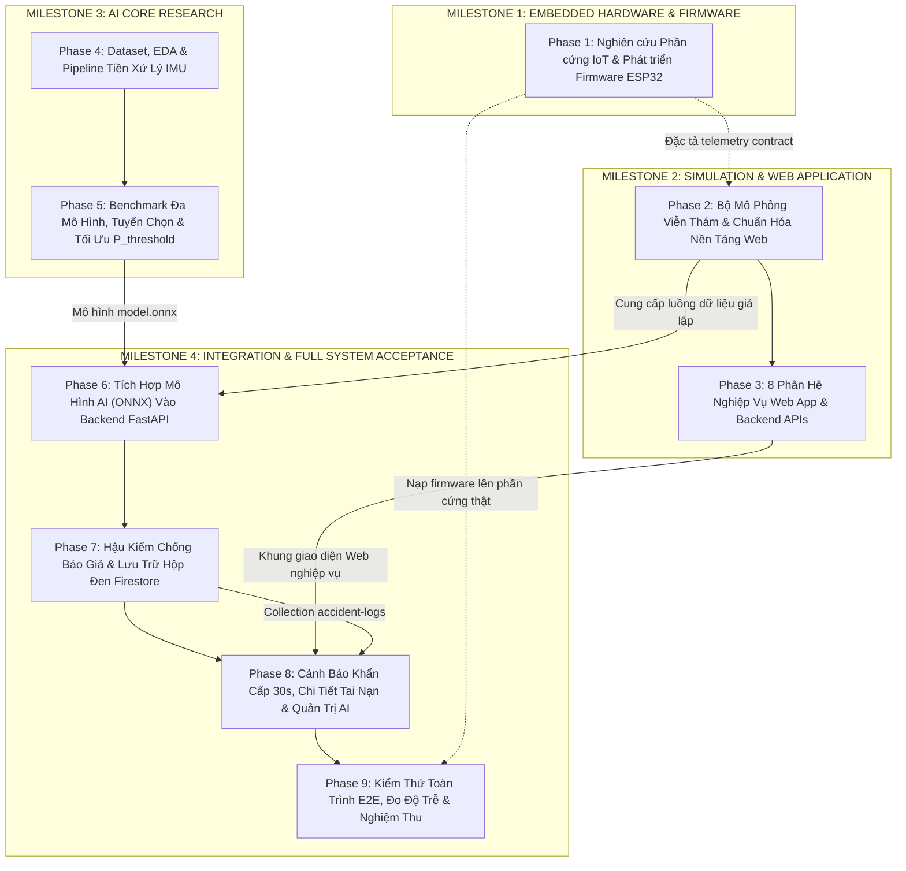

# MASTER ROADMAP: HỆ THỐNG AN TOÀN XE MÁY THÔNG MINH IOT (SMARTBIKE)
> **Phiên bản**: 3.1.0 (Master Roadmap Release — Fully Synchronized)  
> **Cập nhật lần cuối**: 2026-09-11  
> **Trạng thái**: PLANNING ONLY — Tài liệu nguồn chân lý (Source of Truth) cho toàn bộ dự án.

---

# MỤC LỤC
1. [Tuyên Bố Kiến Trúc & Quyết Định Bất Biến (Architecture Invariants)](#1-tuyên-bố-kiến-trúc--quyết-định-bất-biến)
2. [Khảo Sát & Kiểm Kê Hệ Thống Theo 11 Workstreams (A – K)](#2-khảo-sát--kiểm-kê-hệ-thống-theo-11-workstreams)
3. [Phân Tích Hiện Trạng & Khoảng Trống (Gap Analysis)](#3-phân-tích-hiện-trạng--khoảng-trống)
4. [Biểu Đồ Phụ Thuộc Liên Workstream (Dependency Graph)](#4-biểu-đồ-phụ-thuộc-liên-workstream)
5. [Cấu Trúc Lộ Trình 4 Milestones & 9 Phases](#5-cấu-trúc-lộ-trình-4-milestones--9-phases)
6. [Bảng Phân Rã Đầu Việc Chi Tiết (Detailed Task Breakdown TSK-01 đến TSK-09)](#6-bảng-phân-rã-đầu-việc-chi-tiết)
7. [Kế Hoạch Phân Phối Nhân Lực & Chạy Song Song (Team Parallelization)](#7-kế-hoạch-phân-phối-nhân-lực--chạy-song-song)
8. [Tiêu Chuẩn Nghiệm Thu Chung (Acceptance Criteria)](#8-tiêu-chuẩn-nghiệm-thu-chung)
9. [Danh Mục Các Điểm Mở Cần Xác Định (Open & TBD Decisions)](#9-danh-mục-các-điểm-mở-cần-xác-định)

---

# 1. TUYÊN BỐ KIẾN TRÚC & QUYẾT ĐỊNH BẤT BIẾN

1. **Web Application là Client Duy Nhất (Responsive / PWA)**:
   - Loại bỏ hoàn toàn ứng dụng di động Flutter (Android/iOS) trong đề tài ban đầu. Web App xây dựng bằng React 19 + Vite là giao diện duy nhất phục vụ cả màn hình Desktop và Mobile (PWA).
2. **AI Là Trung Tâm Phát Hiện Tai Nạn**:
   - Thuật toán ngưỡng cứng `crashDetAlgo` với tham số $cTHRD = 48$ ($\approx 3.0g$) bị hủy bỏ hoàn toàn.
   - Mô hình AI trên Backend chịu trách nhiệm chính trong việc phân loại chuỗi cảm biến để phát hiện va chạm.
3. **Định Nghĩa Chuẩn Về Ngưỡng Quyết Định $P_{threshold}$**:
   - $P_{threshold}$ là decision threshold áp dụng trên xác suất $P(\text{ACCIDENT})$ do AI Model sinh ra.
   - $P_{threshold}$ **KHÔNG PHẢI** là ngưỡng cảm biến (sensor threshold) và **KHÔNG PHẢI** là một thuật toán thay thế AI.
   - Tuyệt đối không hard-code $P_{threshold}$ ban đầu; giá trị tối ưu được xác định từ kết quả validation và trade-off giữa Recall và Precision sau khi có dữ liệu thực nghiệm, đồng thời có thể tinh chỉnh từ bảng điều khiển quản trị.
4. **Không Chốt Kiến Trúc AI Trước Khi Benchmark**:
   - Không mặc định bất kỳ model nào (LightGBM, XGBoost, 1D-CNN, GRU...) là mô hình cuối cùng.
   - Phải thực hiện đầy đủ pipeline: Dataset $\rightarrow$ EDA $\rightarrow$ Preprocessing $\rightarrow$ Baseline $\rightarrow$ Candidate Models $\rightarrow$ Benchmark $\rightarrow$ Selection $\rightarrow$ Export ONNX.
5. **Không Đặt Chỉ Tiêu AI Cứng Trước Thực Nghiệm**:
   - Không ép các con số (như 98% Recall, 95% Precision) thành requirement cứng trước khi có dữ liệu. Các chỉ tiêu chính thức sẽ được chốt sau bước Benchmark.
6. **Hậu Kiểm Trạng Thái Chỉ Đóng Vai Trò Lọc Nhiễu Hỗ Trợ**:
   - Post-processing (kiểm tra xe ngã đổ $\theta \ge 60^\circ$, vận tốc $v \approx 0$, temporal debounce) chỉ hỗ trợ triệt tiêu báo động giả mặt đường (gờ giảm tốc, ổ gà), **tuyệt đối không thay thế vai trò chẩn đoán của AI**.
7. **Lưu Trữ Hộp Đen Bắt Buộc (Blackbox Logging)**:
   - Mọi sự kiện tai nạn phải lưu vết bản chụp cảm biến thô (50-100 mẫu raw IMU), xác suất $P(\text{ACCIDENT})$, phiên bản mô hình, mốc thời gian và tọa độ GPS vào Firestore collection `accident-logs` để phục vụ thanh tra và tái huấn luyện (retraining).
8. **Phần Cứng & Firmware Là Workstream Độc Lập — KHÔNG Bị Đánh Đồng Với Simulator**:
   - **Hardware Simulator KHÔNG PHẢI là Firmware**. Repository hiện chưa có source code firmware thật; đây là khoảng trống (gap) lớn được quản lý độc lập tại **Phase 1**. Simulator tại **Phase 2** đóng vai trò công cụ kiểm thử viễn thám song song cho nhóm Web, Backend và AI.

---

# 2. KHẢO SÁT & KIỂM KÊ HỆ THỐNG THEO 11 WORKSTREAMS

### Workstream A: HARDWARE (Phần Cứng IoT)
- **Board/MCU**: NodeMCU ESP32 (38 chân, 2 nhân Tensilica Xtensa 32-bit LX6 @ 240MHz, 4MB Flash, Wi-Fi 802.11 b/g/n, Bluetooth v4.2 BR/EDR).
- **Cảm biến IMU 6 trục**: MPU6050 (Gia tốc 3 trục $\pm 2g, \pm 4g, \pm 8g, \pm 16g$; Con quay hồi chuyển 3 trục $\pm 250^\circ/\text{s}, \pm 500^\circ/\text{s}, \pm 1000^\circ/\text{s}, \pm 2000^\circ/\text{s}$). Giao tiếp I2C chân GPIO 32 (SDA), GPIO 33 (SCL).
- **Mô-đun GPS**: U-blox NEO-7M (Hỗ trợ NMEA-0183 bản tin `$GPRMC`, `$GPGGA`). Giao tiếp UART2 chân GPIO 22 (RX2), GPIO 23 (TX2). Tần số cập nhật 1Hz - 5Hz.
- **Mô-đun truyền thông**: SIM7020C NB-IoT (Băng tần Viettel B3/B8). Giao tiếp UART chân GPIO 2 (TX), GPIO 4 (RX) điều khiển bằng tập lệnh AT Commands.
- **Thiết bị cảnh báo ngoại vi**: Còi chíp 5V điều khiển qua transistor NPN C1815 (chân Base kích bởi GPIO 14). Đèn LED hiển thị trạng thái kết nối mạng và GPS.
- **Nguồn nuôi & Mạch sạc**: 2 cell pin Lithium-ion 18650 mắc nối tiếp (7.4V - 8.4V), mạch hạ áp LM2596 điều chỉnh về 5V (cấp cho còi và mô-đun GPS), AMS1117-3.3V cấp cho ESP32.
- **Mạch đo dung lượng pin**: Cầu phân áp điện trở $10\text{k}\Omega / 2\text{k}\Omega$ đưa điện áp pin sau phân áp vào chân GPIO 35 (ADC1_CH7).
- **Tần số lấy mẫu (Sampling Rate)**: Cảm biến IMU lấy mẫu 100Hz (chu kỳ 10ms); gói dữ liệu tổng hợp đóng gói ở tần số 50Hz (chu kỳ 20ms).
- **Kiểm thử phần cứng (Hardware Testing)**: Đo điện áp nguồn, kiểm tra I2C address (`0x68`), kiểm tra bắt sóng GPS ngoài trời, kiểm tra kết nối mạng NB-IoT qua lệnh `AT+CSQ` và `AT+CGATT?`.

### Workstream B: FIRMWARE (Mã Nguồn Nhúng ESP32)
- **Kiến trúc Firmware**: FreeRTOS đa nhiệm hướng sự kiện (Dual-core Tasks trên ESP-IDF / Arduino Framework):
  - *Task 1 (Core 1, Ưu tiên cao - 100Hz)*: Đọc mẫu cảm biến MPU6050 chu kỳ 10ms qua I2C, lọc sơ bộ DLPF và đẩy vào bộ đệm vòng (Ring Buffer).
  - *Task 2 (Core 0, Chu kỳ 1s)*: Phân tích cú pháp NMEA GPS từ UART2, trích xuất tọa độ và vận tốc $v_{GPS}$.
  - *Task 3 (Core 0, Chu kỳ 20ms - 50Hz)*: Đóng gói gói tin JSON viễn thám và điều khiển modem SIM7020C gửi HTTP POST.
  - *Task 4 (Core 0, Chu kỳ 10s)*: Đo điện áp pin qua ADC GPIO 35 và quản lý trạng thái thiết bị.
- **Định dạng gói tin viễn thám (Telemetry Contract)**:
  ```json
  {
    "device_id": "DEV-001",
    "timestamp": "2026-09-11T07:30:00.120Z",
    "battery_level": 92,
    "gps": { "latitude": 21.003118, "longitude": 105.846540, "speed": 38.5 },
    "samples": [
      { "ax": 0.12, "ay": -0.05, "az": 0.98, "gx": 0.01, "gy": -0.02, "gz": 0.00 }
    ]
  }
  ```
- **Xử lý ngắt kết nối & Phục hồi lỗi (Reconnect/Error Handling)**:
  - Watchdog Timer phần cứng (WDT 10s) chống treo hệ thống.
  - Bộ đệm ngoại tuyến Flash SPIFFS lưu trữ tạm thời 200 gói viễn thám khi mất sóng NB-IoT và tự động gửi bù (store-and-forward) khi kết nối lại mạng.
- **Thực trạng Repository**: **CHƯA CÓ TRONG REPOSITORY**. Toàn bộ mã nguồn nhúng hiện đang vắng mặt. Kế hoạch đã quy hoạch xây dựng đầy đủ tại **Phase 1**.

### Workstream C: HARDWARE / DEVICE SIMULATOR (Bộ Giả Lập Thiết Bị)
- **Mục đích**: Công cụ phần mềm độc lập (`tools/device_simulator.py`) phục vụ kiểm thử song song luồng viễn thám mà không phụ thuộc vào thiết bị vật lý.
- **Kịch bản mô phỏng**:
  1. *Lái xe bình thường (Normal Driving)*: Vận tốc $20 - 50\text{ km/h}$, gia tốc rung lắc mặt đường nhẹ ($|a| \approx 1.0g \pm 0.15g$), góc nghiêng thân xe khi ôm cua $\theta \le 20^\circ$.
  2. *Gờ giảm tốc cao & Ổ gà sâu (Severe Speed Bump & Pothole)*: Xung kích lớn theo trục $z$ ($a_z \ge 3.0g$) trong thời gian ngắn ($< 0.2\text{s}$), xe không ngã, sau đó tiếp tục di chuyển thẳng.
  3. *Phanh gấp khẩn cấp (Emergency Hard Braking)*: Gia tốc hãm âm lớn dọc trục $x$ ($a_x \approx -1.2g$) trong $1.5\text{s}$, xe dừng hẳn ($v = 0$), xe không ngã đổ.
  4. *Tai nạn va chạm ngã xe thật (Real Accident & Fall)*: Xung lực va đập cực lớn ($a_{peak} \ge 4.5g$, vận tốc góc $\omega \ge 250^\circ/\text{s}$), thân xe đổ nằm ngang mặt đường ($\theta \ge 60^\circ$) và dừng hẳn ($v_{GPS} = 0$).
  5. *Dắt trộm xe (Anti-theft Trigger)*: Chế độ `anti_thief` bật, phát hiện rung lắc hoặc GPS dịch chuyển quá 20m khỏi vị trí neo.
  6. *Nhiễu cảm biến & Mất kết nối (Noise & Offline)*: Giả lập ngắt kết nối mạng, trễ gói tin (jitter), mất mẫu ngẫu nhiên.

### Workstream D: BACKEND (FastAPI & Application Layer)
- **Kiến trúc**: FastAPI $\ge 0.115.0$, Python 3.11, Uvicorn ASGI. Cấu trúc phân tầng tiêu chuẩn: Controller $\rightarrow$ Service $\rightarrow$ Repository $\rightarrow$ Entity/DTO.
- **Xác thực & Phân quyền (Auth & RBAC)**: JWT Access/Refresh Token, băm mật khẩu PBKDF2 120.000 vòng, phân quyền 2 vai trò `USER` và `ADMIN`.
- **Module nghiệp vụ cốt lõi**:
  - `UserController`: Đăng ký, đăng nhập, hồ sơ cá nhân, đổi mật khẩu, upload avatar qua Cloudinary, cấu hình danh bạ 3 số SOS.
  - `DeviceController`: Liên kết thiết bị qua mã xác thực + mã PIN bí mật, hủy liên kết, cập nhật thông tin xe, bật/tắt chế độ chống trộm `anti_thief`.
  - `TelemetryController`: Endpoint `POST /api/v1/devices/{id}/telemetry` tiếp nhận mảng mẫu IMU 6 trục và GPS.
  - `AccidentController`: Endpoint truy vấn chi tiết tai nạn `GET /api/v1/accidents/{id}`, endpoint hủy cảnh báo `PUT /api/v1/accidents/{id}/cancel`.
  - `AdminController`: Quản trị thiết bị, người dùng và cập nhật cấu hình tham số AI (`GET/PUT /api/v1/admin/ai-config`).
- **AI Inference Engine**: `ai_service.py` tích hợp `onnxruntime`, nạp sẵn mô hình khi khởi động máy chủ (`lifespan`), suy luận ma trận cửa sổ trượt trả về xác suất $P(\text{ACCIDENT})$.
- **Hậu kiểm trạng thái (Post-processing)**: Kiểm tra góc nghiêng ngã xe $\theta \ge 60^\circ$, vận tốc $v \approx 0$, làm mượt xác suất theo thời gian (temporal consensus).

### Workstream E: DATABASE / STORAGE (Google Cloud Firestore & Media Cloud)
- **Cơ sở dữ liệu NoSQL**: Google Cloud Firestore.
- **Collections Hiện Có**:
  - `users/{uid}`: Thông tin người dùng, mật khẩu băm, quyền admin, danh bạ 3 số SOS (`emergency_contacts`).
  - `devices/{id}`: Trạng thái thiết bị, mã xác thực, mã PIN, thông tin xe nhúng, trạng thái chống trộm, tọa độ GPS mới nhất, mức pin.
  - `user-notifications/{id}`: Thông báo khẩn cấp, phân loại tin nhắn, cờ `is_read`.
- **Collections Cần Thêm Mới**:
  - `accident-logs/{id}`: Hộp đen lưu trữ toàn bộ bản chụp 50-100 mẫu cảm biến thô, xác suất $P(\text{ACCIDENT})$, góc nghiêng đo được, vận tốc trước va chạm, tọa độ GPS và lịch sử xử lý (`CONFIRMED`, `CANCELLED_BY_USER`, `SUPPRESSED_FALSE_ALARM`).
  - `system-config/{id}`: Document `ai` lưu cấu hình động $P_{threshold}$, thời gian đếm ngược, phiên bản mô hình.
- **Media Cloud**: Cloudinary SDK phục vụ lưu trữ avatar người dùng.

### Workstream F: AI / MACHINE LEARNING (Nghiên Cứu & Triển Khai AI)
- **Pipeline Khoa Học Tiêu Chuẩn**:
  $$\text{Dataset} \rightarrow \text{EDA} \rightarrow \text{Preprocessing} \rightarrow \text{Feature Extraction / Windowing} \rightarrow \text{Baseline} \rightarrow \text{Candidate Models} \rightarrow \text{Benchmark} \rightarrow \text{Model Selection} \rightarrow \text{Threshold Tuning} \rightarrow \text{ONNX Export} \rightarrow \text{Inference}$$
- **Tập dữ liệu (Dataset)**: Kết hợp các tập dữ liệu cảm biến va chạm/ngã công khai (FallAllD, SisFall, UTD-MHAD, Kaggle motorbike accident) và các mẫu hoạt động bình thường (lái xe, đường xóc, gờ giảm tốc, phanh gấp).
- **Tiền xử lý & Cửa sổ trượt (Preprocessing & Windowing)**: Lọc nhiễu cảm biến, chuẩn hóa biên độ `StandardScaler`. Chia chuỗi thành các cửa sổ trượt $1.0\text{s} - 2.0\text{s}$ (50 - 100 mẫu) với bước trượt gối đầu 50% (overlap 50%) để không bỏ sót xung đỉnh va chạm.
- **Mô hình cơ sở (Baseline Model)**: Decision Tree hoặc Logistic Regression trên các đặc trưng thống kê thô ($|a|_{max}, |a|_{mean}, \text{Std}(a)$).
- **Mô hình ứng viên (Candidate Models)**:
  - *Nhóm Gradient Boosting / Tree-based*: LightGBM, XGBoost, Random Forest (kết hợp trích xuất đặc trưng miền thời gian và miền tần số FFT).
  - *Nhóm Deep Learning*: 1D-CNN, GRU, LSTM, CNN-LSTM (xử lý trực tiếp ma trận tín hiệu chuỗi thời gian).
- **Đánh giá & Tuyển chọn**: Đánh giá trên cùng tập test độc lập qua Recall, Precision, F1-Score, PR-AUC, dung lượng mô hình và thời gian suy luận (Latency trên CPU).
- **Lựa chọn ngưỡng quyết định $P_{threshold}$**: Xác định ngưỡng trên xác suất $P(\text{ACCIDENT})$ dựa trên đường cong PR-Curve và phân tích đánh đổi Recall vs Precision sau thực nghiệm.
- **Đóng gói triển khai**: Xuất mô hình chiến thắng sang chuẩn định dạng ONNX (`model.onnx`).

### Workstream G: WEB APPLICATION (Nền Tảng Giao Diện Duy Nhất)
- **Công nghệ**: React 19, Vite, React Router v7, Leaflet, PWA Manifest.
- **Danh mục phân hệ & Trạng thái mã nguồn**:
  1. *Authentication*: Đăng nhập, đăng ký, đăng xuất, quên mật khẩu $\rightarrow$ **EXISTING** (Cần hoàn thiện kết nối dịch vụ).
  2. *User Profile*: Xem/sửa thông tin cá nhân, cập nhật avatar Cloudinary, danh bạ 3 số SOS $\rightarrow$ **EXISTING (PARTIAL)**.
  3. *Dashboard*: Thẻ trạng thái xe, trạng thái pin, nút bật/tắt chống trộm nhanh $\rightarrow$ **EXISTING (PARTIAL)**.
  4. *Vehicle Management*: Cập nhật thông tin chi tiết xe (hãng, dòng xe, biển số) $\rightarrow$ **EXISTING**.
  5. *Device Management*: Nhập mã xác thực + mã PIN để liên kết thiết bị, hủy liên kết $\rightarrow$ **EXISTING**.
  6. *GPS / Map*: Bản đồ Leaflet hiển thị vị trí thời gian thực, nút yêu cầu cập nhật vị trí $\rightarrow$ **EXISTING**.
  7. *Sensor Monitoring*: Biểu đồ trực quan hóa dữ liệu cảm biến thời gian thực $\rightarrow$ **PARTIAL / MOCK UI** (Cần kết nối API viễn thám thật).
  8. *Accident History*: Danh sách các sự cố va chạm theo thời gian, bộ lọc ngày tháng $\rightarrow$ **EXISTING (PARTIAL)**.
  9. *Accident Detail*: Bản đồ vị trí tai nạn, thẻ chỉ số AI ($P$, gia tốc đỉnh, góc nghiêng), biểu đồ sóng hộp đen SVG $\rightarrow$ **MUST MODIFY / NEW**.
  10. *Notification Center*: Dropdown chuông thông báo, badge đếm tin chưa đọc, đánh dấu đã đọc $\rightarrow$ **EXISTING (PARTIAL)**.
  11. *Emergency Alert*: Modal toàn màn hình viền đỏ nhấp nháy, còi hú báo động, bộ đếm lùi 30s ("Tôi an toàn") $\rightarrow$ **MISSING / NEW**.
  12. *Admin Management*: Bảng điều khiển quản lý người dùng và thiết bị $\rightarrow$ **EXISTING**.
  13. *Admin AI Configuration*: Cấu hình ngưỡng $P_{threshold}$, thời gian đếm lùi, góc nghiêng hậu kiểm $\rightarrow$ **MUST MODIFY** (Thay thế ô nhập ngưỡng G-force tĩnh cũ).
  14. *Responsive UI & PWA*: Layout thích ứng màn hình điện thoại và máy tính, service worker cache $\rightarrow$ **EXISTING (PARTIAL)**.

### Workstream H: NOTIFICATION / EMERGENCY (Cảnh Báo Khẩn Cấp & SOS)
- **Pipeline Cảnh Báo Khẩn Cấp**:
  $$\text{AI Va Chạm} \xrightarrow{P \ge P_{threshold}} \text{Hậu Kiểm Xe Đổ \& Dừng} \rightarrow \text{Tạo AccidentLog} \rightarrow \text{Sinh UserNotification} \rightarrow \text{Web App Kích Hoạt Modal 30s}$$
- **Giao diện khẩn cấp & Đếm ngược**:
  - Web App tự động bật modal khẩn cấp, phát âm thanh còi hú qua Web Audio API.
  - Đồng hồ đếm lùi 30 giây:
    - Nếu bấm **"Tôi an toàn / Hủy cảnh báo"**: Dừng âm thanh, gọi API hủy cảnh báo, cập nhật Firestore trạng thái `CANCELLED_BY_USER`.
    - Nếu hết 30 giây không bấm: Tự động chuyển trạng thái `SOS_DISPATCHED`, kích hoạt danh bạ người thân khẩn cấp.
- **Xử lý thất bại & Thử lại (Failure / Retry)**: Đảm bảo thông báo chưa đọc được lưu bền vững trong Firestore, cơ chế polling tự động kết nối lại khi mất mạng.

### Workstream I: DEPLOYMENT / INFRASTRUCTURE (Đóng Gói & Vận Hành)
- **Mục tiêu**: Tối ưu cho môi trường demo học thuật và đánh giá bài tập lớn — vận hành trơn tru với lệnh duy nhất:
  ```bash
  docker compose up --build
  ```
- **Backend Container**: `backend/Dockerfile` (Base image `python:3.11-slim`, cài đặt thư viện từ `requirements.txt`, chạy qua Uvicorn port `8000`).
- **Frontend Container**: `frontend/Dockerfile` (Multi-stage build Node.js + Nginx port `80` hoặc Vite server port `5173`).
- **Quản lý biến môi trường**: Tệp `backend/.env` và khóa xác thực `backend/firebase-credentials.json` được duy trì sẵn sàng cho việc kiểm thử chấm điểm, không đặt các rào cản bảo mật production phức tạp.
- **Health Check & Logs**: Endpoint `GET /health` kiểm tra trạng thái kết nối Firestore và nạp mô hình AI; Docker logs ghi nhận chi tiết luồng xử lý.

### Workstream J: TESTING (Chiến Lược Kiểm Thử Toàn Diện)
- **Unit Testing**:
  - Backend: Kiểm thử thuật toán tính góc nghiêng $\theta$, logic làm mượt xác suất EMA, validation Pydantic DTO.
  - AI Engine: Kiểm thử nạp session ONNX, kiểm tra đầu ra nằm trong $[0.0, 1.0]$, đo thời gian suy luận $< 50\text{ ms}$.
- **Firmware / Hardware Testing**: Đo kiểm bus I2C, đọc NMEA GPS, kiểm tra kết nối AT Command SIM7020C, kiểm thử cơ chế lưu ngoại tuyến SPIFFS.
- **API & Integration Testing**: Kiểm thử tự động luồng xác thực JWT, liên kết thiết bị, bật/tắt chống trộm, gửi telemetry và truy vấn thông báo qua `httpx`.
- **Simulator Testing**: Kiểm thử bộ giả lập `device_simulator.py` phát đúng định dạng gói tin và chu kỳ thời gian.
- **AI Evaluation**: Đánh giá mô hình trên tập kiểm thử độc lập (Recall, Precision, F1-Score, PR-AUC, Confusion Matrix).
- **Frontend / UI Testing**: Kiểm thử giao diện responsive, bộ đếm ngược 30 giây, âm thanh còi hú và các form nhập liệu.
- **End-to-End System Testing**: Kiểm thử toàn trình 4 kịch bản thực tế (Ngã xe thật, Gờ giảm tốc, Phanh gấp, Dắt trộm xe).
- **Latency Benchmark**: Đo lường tổng thời gian từ lúc phát gói tin đến khi Web App hiển thị cảnh báo ($< 500\text{ ms}$).

### Workstream K: DOCUMENTATION (Hệ Thống Tài Liệu Kỹ Thuật)
- **Tài liệu cài đặt & vận hành**: `README.md`, `HUONG_DAN_CHAY_DOCKER.md`.
- **Tài liệu phần cứng & firmware**: `docs/hardware_schematic.md`, `firmware/README.md`.
- **Tài liệu kiến trúc & khảo sát**: Thư mục `.planning/codebase/` (`STACK.md`, `INTEGRATIONS.md`, `ARCHITECTURE.md`, `STRUCTURE.md`, `CONVENTIONS.md`, `TESTING.md`, `CONCERNS.md`).
- **Tài liệu nghiên cứu AI**: Báo cáo EDA, báo cáo Benchmark so sánh mô hình (`BENCHMARK_REPORT.md`).
- **Tài liệu nghiệm thu toàn trình**: Báo cáo nghiệm thu kỹ thuật hệ thống (`SYSTEM_VERIFICATION_REPORT.md`).

---

# 3. PHÂN TÍCH HIỆN TRẠNG & KHOẢNG TRỐNG (GAP ANALYSIS)

| Hạng Mục | Hiện Trạng Mã Nguồn (As-Is) | Mục Tiêu Yêu Cầu (To-Be) | Phân Loại Khoảng Trống (Gap) |
| :--- | :--- | :--- | :--- |
| **Firmware ESP32** | Chưa có thư mục firmware trong repo | Mã nguồn nhúng FreeRTOS đọc MPU6050 100Hz, NMEA GPS và gửi NB-IoT | **MISSING (Quy hoạch tại Phase 1)** |
| **Bộ mô phỏng viễn thám** | Chưa có công cụ giả lập | Script `tools/device_simulator.py` phát 6 kịch bản viễn thám | **MISSING (Quy hoạch tại Phase 2)** |
| **Mô hình AI phát hiện tai nạn**| Dùng thuật toán ngưỡng cứng `crashDetAlgo` ($cTHRD$) | Mô hình AI (ONNX) suy luận xác suất $P(\text{ACCIDENT})$ trên chuỗi IMU 6 trục | **MUST REPLACE (Quy hoạch Phase 4, 5, 6)** |
| **API Telemetry Backend** | Chỉ có `POST /devices/{id}/locations` (lat/lng) | Thêm `POST /api/v1/devices/{id}/telemetry` nhận mảng 50-100 mẫu IMU | **MUST MODIFY (Quy hoạch tại Phase 6)** |
| **Hậu kiểm trạng thái xe** | Chưa có logic hậu kiểm | Kiểm tra góc nghiêng $\theta \ge 60^\circ$ và vận tốc dừng để triệt tiêu báo giả | **NEW (Quy hoạch tại Phase 7)** |
| **Lưu trữ hộp đen** | Chỉ có thông báo trong `user-notifications` | Collection `accident-logs` lưu 100 mẫu cảm biến thô và tham số AI | **NEW (Quy hoạch tại Phase 7)** |
| **Giao diện Web App** | React 19 + Vite, 6 tệp tin rỗng 0-byte, mock UI cảm biến | Hoàn thiện 6 tệp rỗng, kết nối API thật, modal cảnh báo khẩn cấp 30s | **PARTIAL $\rightarrow$ COMPLETE (Phase 2, 3, 8)** |
| **Cấu hình Quản trị AI** | Nhập ngưỡng G-force tĩnh trong `AdminSettings.jsx` | Bảng điều khiển tinh chỉnh $P_{threshold}$, thời gian đếm lùi, xem model version | **MUST MODIFY (Quy hoạch tại Phase 8)** |
| **Kiểm thử tự động** | Chưa có test suite nào | Bộ kiểm thử tự động pytest, script đo độ trễ và test E2E 4 kịch bản | **MISSING (Quy hoạch Phase 6, 9)** |

---

# 4. BIỂU ĐỒ PHỤ THUỘC LIÊN WORKSTREAM (DEPENDENCY GRAPH)



---

# 5. CẤU TRÚC LỘ TRÌNH 4 MILESTONES & 9 PHASES

```
HỆ THỐNG AN TOÀN XE MÁY THÔNG MINH IOT (SMARTBIKE)
│
├── MILESTONE 1: EMBEDDED HARDWARE & FIRMWARE (Phần Cứng & Mã Nguồn Nhúng)
│   └── Phase 1: Nghiên Cứu Phần Cứng IoT & Phát Triển Firmware ESP32
│
├── MILESTONE 2: SIMULATION & WEB APPLICATION (Bộ Mô Phỏng & Ứng Dụng Web)
│   ├── Phase 2: Xây Dựng Bộ Mô Phỏng Viễn Thám & Chuẩn Hóa Nền Tảng Web
│   └── Phase 3: Triển Khai 8 Phân Hệ Nghiệp Vụ Web App & Backend APIs
│
├── MILESTONE 3: AI CORE RESEARCH (Nghiên Cứu & Tuyển Chọn Mô Hình AI)
│   ├── Phase 4: Khảo Sát Dataset, EDA & Pipeline Tiền Xử Lý Tín Hiệu IMU
│   └── Phase 5: Benchmark Đa Mô Hình, Tuyển Chọn & Tối Ưu Hóa Ngưỡng P_threshold
│
└── MILESTONE 4: INTEGRATION & FULL SYSTEM ACCEPTANCE (Hợp Nhất Toàn Trình & Nghiệm Thu)
    ├── Phase 6: Tích Hợp Mô Hình AI (ONNX) Vào Backend FastAPI
    ├── Phase 7: Hậu Kiểm Chống Báo Giả & Lưu Trữ Hộp Đen Firestore
    ├── Phase 8: Cảnh Báo Khẩn Cấp 30s, Chi Tiết Tai Nạn & Quản Trị AI
    └── Phase 9: Kiểm Thử Toàn Trình E2E, Đo Độ Trễ & Nghiệm Thu Hệ Thống
```

---

# 6. BẢNG PHÂN RÃ ĐẦU VIỆC CHI TIẾT

### Phase 1: Nghiên Cứu Phần Cứng IoT & Phát Triển Firmware ESP32
> **Mục tiêu**: Xây dựng hoàn chỉnh mã nguồn firmware FreeRTOS cho ESP32 đọc cảm biến MPU6050 100Hz, NMEA GPS NEO-7M, đo pin ADC và gửi dữ liệu qua SIM7020C NB-IoT.

| Task ID | Workstream | Tên Nhiệm Vụ | Trạng Thái | Tệp Tin / Module Ảnh Hưởng | Phụ Thuộc | Tiêu Chuẩn Nghiệm Thu |
| :--- | :--- | :--- | :--- | :--- | :--- | :--- |
| **TSK-101** | Hardware (A) | Khảo sát & lập tài liệu sơ đồ mạch điện, kết nối GPIO ESP32, MPU6050, GPS, SIM7020C | EXISTING (DOCS) | `docs/hardware_schematic.md` | Không | Sơ đồ khớp 100% tài liệu luận văn và bảng chân pinout |
| **TSK-102** | Firmware (B) | Khởi tạo cấu trúc dự án Firmware FreeRTOS đa nhiệm (ESP-IDF / PlatformIO) | MISSING / NEW | `firmware/smartbike_esp32/platformio.ini`, `src/main.cpp` | TSK-101 | Dự án biên dịch thành công không cảnh báo |
| **TSK-103** | Firmware (B) | Viết module Driver I2C MPU6050 đọc 6 trục quán tính chu kỳ 10ms (100Hz) & Ring Buffer | MISSING / NEW | `firmware/smartbike_esp32/src/mpu6050_driver.cpp` | TSK-102 | Đọc chính xác $a_x, a_y, a_z, \omega_x, \omega_y, \omega_z$ qua I2C |
| **TSK-104** | Firmware (B) | Viết module Parser UART2 đọc và phân tích bản tin NMEA GPS NEO-7M | MISSING / NEW | `firmware/smartbike_esp32/src/gps_parser.cpp` | TSK-102 | Phân tích đúng tọa độ lat, lng, thời gian UTC và vận tốc $v_{GPS}$ |
| **TSK-105** | Firmware (B) | Viết module Quản lý nguồn & Đo điện áp pin qua ADC GPIO 35 (Cầu phân áp 10k/2k) | MISSING / NEW | `firmware/smartbike_esp32/src/power_manager.cpp` | TSK-102 | Đọc và quy đổi chính xác điện áp pin 2S (6.4V - 8.4V) |
| **TSK-106** | Firmware (B) | Viết module AT Command Client SIM7020C kết nối NB-IoT Viettel và đóng gói HTTP POST | MISSING / NEW | `firmware/smartbike_esp32/src/nbiot_client.cpp` | TSK-103, TSK-104 | Gửi thành công gói tin telemetry chuẩn JSON qua mạng di động |
| **TSK-107** | Firmware (B) | Triển khai Watchdog Timer (WDT 10s) và Bộ đệm Flash SPIFFS lưu trữ ngoại tuyến | MISSING / NEW | `firmware/smartbike_esp32/src/offline_buffer.cpp` | TSK-106 | Thiết bị mất mạng không treo, tự gửi bù khi có mạng trở lại |
| **TSK-108** | Testing (J) | Kiểm thử tích hợp phần cứng & Firmware (HIL Test, đo dòng tiêu thụ, test mất sóng) | MISSING / NEW | `firmware/tests/test_hardware.cpp` | TSK-103 - TSK-107 | Hệ thống vận hành liên tục 24h không rò rỉ bộ nhớ |

---

### Phase 2: Xây Dựng Bộ Mô Phỏng Viễn Thám & Chuẩn Hóa Nền Tảng Web
> **Mục tiêu**: Xây dựng công cụ giả lập phần cứng phục vụ kiểm thử song song; dọn dẹp tàn dư Flutter và hoàn thiện khung nền tảng Web App.

| Task ID | Workstream | Tên Nhiệm Vụ | Trạng Thái | Tệp Tin / Module Ảnh Hưởng | Phụ Thuộc | Tiêu Chuẩn Nghiệm Thu |
| :--- | :--- | :--- | :--- | :--- | :--- | :--- |
| **TSK-201** | Simulator (C) | Xây dựng script Python dòng lệnh `device_simulator.py` phát gói tin viễn thám qua HTTP | MISSING / NEW | `tools/device_simulator.py` | TSK-106 (Contract) | Script chạy độc lập, phát gói tin JSON 50Hz chuẩn |
| **TSK-202** | Simulator (C) | Tích hợp 6 kịch bản dữ liệu (Lái bình thường, Gờ giảm tốc, Phanh gấp, Ngã xe, Trộm, Offline)| MISSING / NEW | `tools/scenarios/` | TSK-201 | Cho phép chọn kịch bản linh hoạt qua tham số dòng lệnh |
| **TSK-203** | Web App (G) | Rà soát và loại bỏ hoàn toàn các ghi chú, cấu hình tàn dư Flutter/Mobile trong dự án | MUST MODIFY | `frontend/`, `README.md` | Không | Không còn nhắc tới Flutter trong toàn bộ mã nguồn Web |
| **TSK-204** | Web App (G) | Hoàn thiện 6 tệp tin rỗng 0-byte (`accidentService.js`, `sensorService.js`, 3 hooks, context) | MISSING / MODIFY | `frontend/src/services/`, `hooks/` | Không | Các tệp có đầy đủ cấu trúc hàm export, không lỗi import |
| **TSK-205** | Web App (G) | Chuẩn hóa cấu hình Vite proxy và kiểm tra Docker Compose thông luồng | MUST MODIFY | `frontend/vite.config.js`, `docker-compose.yml`| TSK-204 | Lệnh `docker compose up --build` mở được cả Web & API |

---

### Phase 3: Triển Khai 8 Phân Hệ Nghiệp Vụ Web App & Backend APIs
> **Mục tiêu**: Xây dựng hoàn chỉnh 8 phân hệ nghiệp vụ trên Web App và các API Backend tương ứng.

| Task ID | Workstream | Tên Nhiệm Vụ | Trạng Thái | Tệp Tin / Module Ảnh Hưởng | Phụ Thuộc | Tiêu Chuẩn Nghiệm Thu |
| :--- | :--- | :--- | :--- | :--- | :--- | :--- |
| **TSK-301** | Web / BE (G, D) | Module 1: Luồng Xác thực (Đăng ký, Đăng nhập JWT, Profile, Avatar Cloudinary, 3 số SOS) | EXISTING / MODIFY| `Profile.jsx`, `auth_controller.py` | TSK-204 | Cập nhật được hồ sơ và lưu 3 số SOS vào Firestore |
| **TSK-302** | Web / BE (G, D) | Module 2: Dashboard hiển thị trạng thái xe, mức pin, toggle chống trộm `anti_thief` | EXISTING / MODIFY| `Dashboard.jsx`, `device_service.py` | TSK-301 | Bật/tắt chống trộm cập nhật ngay lập tức vào database |
| **TSK-303** | Web / BE (G, D) | Module 3: Quản lý thông tin phương tiện (Hãng xe, dòng xe, màu sắc, biển số xe) | EXISTING / MODIFY| `Vehicle.jsx`, `device_dto.py` | TSK-302 | Cập nhật thông tin xe máy hiển thị trực quan |
| **TSK-304** | Web / BE (G, D) | Module 4: Quản lý thiết bị IoT (Liên kết mã xác thực + PIN bảo mật, hủy liên kết) | EXISTING / MODIFY| `Device.jsx`, `device_controller.py` | TSK-302 | Nhập đúng mã xác thực và PIN mới liên kết được thiết bị |
| **TSK-305** | Web / BE (G, D) | Module 5: Giám sát cảm biến viễn thám thời gian thực (Biểu đồ gia tốc và góc nghiêng) | PARTIAL / MODIFY | `SensorData.jsx`, `sensorService.js` | TSK-204 | Chuyển từ mock UI sang vẽ biểu đồ dữ liệu thật |
| **TSK-306** | Web / BE (G, D) | Module 6: Bản đồ số Leaflet định vị xe thời gian thực, nút yêu cầu cập nhật vị trí | EXISTING / MODIFY| `Tracking.jsx`, `MapComponent.jsx` | TSK-304 | Ghim đúng vị trí GPS trên bản đồ OpenStreetMap |
| **TSK-307** | Web / BE (G, D) | Module 7: Lịch sử sự cố tai nạn (Danh sách sự kiện, bộ lọc thời gian, trạng thái) | EXISTING / MODIFY| `AccidentHistory.jsx` | TSK-304 | Hiển thị danh sách sự cố đã xảy ra từ database |
| **TSK-308** | Web / BE (G, D) | Module 8: Trung tâm thông báo (Dropdown chuông, badge đếm tin chưa đọc, đánh dấu đã đọc)| EXISTING / MODIFY| `Header.jsx`, `NotificationContext.jsx`| TSK-204 | Huy hiệu hiển thị đúng số tin chưa đọc, bấm đọc mất badge |

---

### Phase 4: Khảo Sát Dataset, EDA & Pipeline Tiền Xử Lý Tín Hiệu IMU
> **Mục tiêu**: Thu thập dữ liệu cảm biến đa chiều, phân tích đặc trưng va chạm (EDA) và xây dựng pipeline tiền xử lý tín hiệu.

| Task ID | Workstream | Tên Nhiệm Vụ | Trạng Thái | Tệp Tin / Module Ảnh Hưởng | Phụ Thuộc | Tiêu Chuẩn Nghiệm Thu |
| :--- | :--- | :--- | :--- | :--- | :--- | :--- |
| **TSK-401** | AI / ML (F) | Khảo sát & chuẩn hóa bộ dữ liệu cảm biến IMU va chạm và lái xe thông thường | MISSING / NEW | `ai_research/data/` | Không | Có tập dữ liệu chứa gia tốc và con quay hồi chuyển 6 trục |
| **TSK-402** | AI / ML (F) | Phân tích khám phá dữ liệu (EDA): Phân tích phân phối, phổ tần số FFT, nhãn mất cân bằng | MISSING / NEW | `ai_research/notebooks/01_eda.ipynb` | TSK-401 | Báo cáo trực quan hóa xung lực va chạm vs rung sóc mặt đường |
| **TSK-403** | AI / ML (F) | Xây dựng pipeline tiền xử lý: Lọc nhiễu, chuẩn hóa biên độ `StandardScaler` | MISSING / NEW | `ai_research/src/preprocessing.py` | TSK-402 | Dữ liệu được đưa về phân phối chuẩn hóa không lỗi |
| **TSK-404** | AI / ML (F) | Xây dựng cơ chế cửa sổ trượt (Sliding Window 1-2s, overlap 50%) trích xuất ma trận | MISSING / NEW | `ai_research/src/windowing.py` | TSK-403 | Ma trận cửa sổ trượt giữ nguyên đỉnh va chạm, không mất mẫu |

---

### Phase 5: Benchmark Đa Mô Hình, Tuyển Chọn & Tối Ưu Hóa Ngưỡng $P_{threshold}$
> **Mục tiêu**: Huấn luyện mô hình cơ sở và các ứng viên, đánh giá định lượng, chọn mô hình tối ưu và xác định khoảng ngưỡng $P_{threshold}$.

| Task ID | Workstream | Tên Nhiệm Vụ | Trạng Thái | Tệp Tin / Module Ảnh Hưởng | Phụ Thuộc | Tiêu Chuẩn Nghiệm Thu |
| :--- | :--- | :--- | :--- | :--- | :--- | :--- |
| **TSK-501** | AI / ML (F) | Xây dựng mô hình cơ sở (Baseline Model: Decision Tree / Logistic Regression) | MISSING / NEW | `ai_research/src/baseline.py` | TSK-404 | Thiết lập mốc tham chiếu đo lường hiệu năng |
| **TSK-502** | AI / ML (F) | Thử nghiệm nhóm Tree-based: LightGBM, XGBoost, Random Forest (kết hợp đặc trưng FFT) | MISSING / NEW | `ai_research/src/train_trees.py` | TSK-404 | Huấn luyện và xuất kết quả đo lường trên tập validation |
| **TSK-503** | AI / ML (F) | Thử nghiệm nhóm Deep Learning: 1D-CNN, GRU/LSTM, CNN-LSTM trên ma trận chuỗi thời gian | MISSING / NEW | `ai_research/src/train_deep.py` | TSK-404 | Huấn luyện với cơ chế Early Stopping và Class Weights |
| **TSK-504** | AI / ML (F) | Đánh giá so sánh định lượng (Recall, Precision, F1, PR-AUC, Latency CPU) | MISSING / NEW | `ai_research/reports/BENCHMARK.md` | TSK-502, TSK-503 | Bảng đối sánh định lượng minh bạch giữa tất cả mô hình |
| **TSK-505** | AI / ML (F) | Tuyển chọn mô hình tối ưu và xác định khoảng tối ưu cho ngưỡng quyết định $P_{threshold}$ | MISSING / NEW | `ai_research/reports/SELECTION.md` | TSK-504 | Chọn 1 mô hình tốt nhất, xác định $P_{threshold}$ theo PR trade-off |
| **TSK-506** | AI / ML (F) | Xuất mô hình chiến thắng và scaler sang định dạng tối ưu ONNX | MISSING / NEW | `ai_research/exported/model.onnx` | TSK-505 | File `.onnx` hợp lệ, chạy suy luận độc lập trên CPU |

---

### Phase 6: Tích Hợp Mô Hình AI (ONNX) Vào Backend FastAPI
> **Mục tiêu**: Nhúng runtime ONNX vào Backend, xây dựng API tiếp nhận viễn thám và xác thực độ trễ suy luận thời gian thực.

| Task ID | Workstream | Tên Nhiệm Vụ | Trạng Thái | Tệp Tin / Module Ảnh Hưởng | Phụ Thuộc | Tiêu Chuẩn Nghiệm Thu |
| :--- | :--- | :--- | :--- | :--- | :--- | :--- |
| **TSK-601** | Backend (D) | Cài đặt `onnxruntime` và `numpy` vào `backend/requirements.txt` | MUST MODIFY | `backend/requirements.txt` | Không | Cài đặt thư viện thành công trong container Python 3.11 |
| **TSK-602** | Backend (D) | Xây dựng module `ai_service.py` quản lý ONNX InferenceSession (Pre-load tại lifespan) | MISSING / NEW | `backend/app/service/ai_service.py` | TSK-506, TSK-601 | Session ONNX nạp sẵn sàng khi máy chủ khởi động |
| **TSK-603** | Backend (D) | Định nghĩa Pydantic Schemas tiếp nhận gói viễn thám cảm biến đa chiều | MISSING / NEW | `backend/app/dto/telemetry_dto.py` | Không | Schema kiểm tra chặt chẽ cấu trúc mảng IMU và GPS |
| **TSK-604** | Backend (D) | Xây dựng endpoint tiếp nhận viễn thám `POST /api/v1/devices/{id}/telemetry` | MISSING / NEW | `backend/app/controller/device_controller.py`| TSK-602, TSK-603 | Endpoint nhận gói tin, gọi AI suy luận trả về xác suất $P$ |
| **TSK-605** | Testing (J) | Kiểm thử đo độ trễ suy luận của AI Engine trên CPU Backend | MISSING / NEW | `tests/unit/test_ai_inference.py` | TSK-604 | Thời gian suy luận cho 1 cửa sổ trượt đạt $< 50\text{ ms}$ |

---

### Phase 7: Hậu Kiểm Chống Báo Giả & Lưu Trữ Hộp Đen Firestore
> **Mục tiêu**: Xây dựng bộ lọc hậu kiểm góc nghiêng và làm mượt xác suất; thiết lập cấu trúc lưu trữ hộp đen `accident-logs`.

| Task ID | Workstream | Tên Nhiệm Vụ | Trạng Thái | Tệp Tin / Module Ảnh Hưởng | Phụ Thuộc | Tiêu Chuẩn Nghiệm Thu |
| :--- | :--- | :--- | :--- | :--- | :--- | :--- |
| **TSK-701** | Backend (D) | Triển khai thuật toán hậu kiểm góc nghiêng ngã xe ($\theta \ge 60^\circ$) và dừng xe ($v \approx 0$) | MISSING / NEW | `backend/app/service/device_service.py` | TSK-604 | Phân biệt chính xác giữa ngã xe thật và xóc gờ giảm tốc |
| **TSK-702** | Backend (D) | Triển khai cơ chế làm mượt xác suất theo thời gian (EMA / Window Consensus Debouncing) | MISSING / NEW | `backend/app/service/device_service.py` | TSK-701 | Triệt tiêu các xung kích đơn lẻ do nhiễu cảm biến |
| **TSK-703** | Database (E) | Thiết kế Entity và DTO cho collection hộp đen `accident-logs` | MISSING / NEW | `backend/app/entity/accident_log.py` | Không | Khai báo đầy đủ các trường: snapshot mẫu thô, $P$, tilt, GPS |
| **TSK-704** | Backend / DB (D, E) | Xử lý lưu vết sự kiện: Tạo bản ghi `accident-logs` và kích hoạt `user-notifications` | MISSING / MODIFY | `backend/app/service/notification_service.py`| TSK-702, TSK-703 | Sự cố xác nhận sinh thông báo khẩn cấp gắn mã hộp đen |

---

### Phase 8: Cảnh Báo Khẩn Cấp 30s, Chi Tiết Tai Nạn & Quản Trị AI
> **Mục tiêu**: Xây dựng modal cảnh báo khẩn cấp toàn màn hình có đếm ngược 30s ("Tôi an toàn"), trang chi tiết tai nạn và trang cấu hình AI động.

| Task ID | Workstream | Tên Nhiệm Vụ | Trạng Thái | Tệp Tin / Module Ảnh Hưởng | Phụ Thuộc | Tiêu Chuẩn Nghiệm Thu |
| :--- | :--- | :--- | :--- | :--- | :--- | :--- |
| **TSK-801** | Web App (G, H) | Xây dựng modal cảnh báo khẩn cấp toàn màn hình viền đỏ nhấp nháy kèm còi hú | MISSING / MODIFY | `frontend/src/components/layout/AlertPopup.jsx`| TSK-308 | Modal bật tức thời khi có thông báo `ACCIDENT`, phát âm thanh |
| **TSK-802** | Web App (G, H) | Tích hợp bộ đếm ngược 30s và nút "Tôi an toàn / Hủy báo động" | MISSING / MODIFY | `AlertPopup.jsx`, `accidentService.js` | TSK-801 | Bấm nút hủy gửi lệnh cập nhật `CANCELLED_BY_USER`, tắt còi |
| **TSK-803** | Backend (D) | Xây dựng API hủy cảnh báo `PUT /api/v1/accidents/{id}/cancel` | MISSING / NEW | `backend/app/controller/accident_controller.py`| TSK-704 | API cập nhật trạng thái trong `accident-logs` thành công |
| **TSK-804** | Web App (G) | Nâng cấp trang Chi tiết tai nạn: Bản đồ phóng to, thẻ chỉ số AI ($P$, $g$, $\theta$, $v$) | MUST MODIFY | `frontend/src/pages/user/accident/AccidentDetail.jsx`| TSK-703 | Hiển thị đầy đủ tọa độ và các tham số phân tích AI |
| **TSK-805** | Web App (G) | Tích hợp biểu đồ sóng SVG trực quan hóa mảng mẫu cảm biến thô từ hộp đen | MISSING / NEW | `AccidentDetail.jsx` | TSK-804 | Vẽ biểu đồ 3 trục gia tốc có vạch chỉ thị đỉnh va chạm |
| **TSK-806** | Web / BE (G, D) | Nâng cấp trang Quản trị viên: Cấu hình động $P_{threshold}$, thời gian đếm lùi, xem model version| MUST MODIFY | `AdminSettings.jsx`, `AdminController` | TSK-604 | Admin đổi $P_{threshold}$ trên Web, Backend áp dụng ngay |

---

### Phase 9: Kiểm Thử Toàn Trình E2E, Đo Độ Trễ & Nghiệm Thu Hệ Thống
> **Mục tiêu**: Kiểm thử tích hợp toàn trình 4 kịch bản viễn thám, đo lường độ trễ toàn trình, kiểm chứng Docker và lập hồ sơ nghiệm thu.

| Task ID | Workstream | Tên Nhiệm Vụ | Trạng Thái | Tệp Tin / Module Ảnh Hưởng | Phụ Thuộc | Tiêu Chuẩn Nghiệm Thu |
| :--- | :--- | :--- | :--- | :--- | :--- | :--- |
| **TSK-901** | Testing (J) | Viết bộ kịch bản kiểm thử tích hợp tự động toàn trình qua pytest (`test_e2e_pipeline.py`)| MISSING / NEW | `tests/e2e/test_e2e_pipeline.py` | TSK-202, TSK-803 | Tự động chạy và xác thực dữ liệu trong Firestore |
| **TSK-902** | Testing (J) | Kiểm thử kịch bản kép: Va chạm ngã xe thật (bật cảnh báo) vs Gờ giảm tốc/Phanh gấp (triệt tiêu) | MISSING / NEW | `tests/e2e/test_scenarios.py` | TSK-901 | 100% kịch bản phản hồi đúng logic mong đợi |
| **TSK-903** | Testing (J) | Đo lường độ trễ toàn trình từ lúc phát gói tin đến lúc Web App hiển thị cảnh báo | MISSING / NEW | `tests/e2e/benchmark_latency.py` | TSK-901 | Tổng độ trễ toàn trình đạt $< 500\text{ ms}$ |
| **TSK-904** | Deployment (I) | Kiểm tra và tối ưu hóa quy trình đóng gói khởi chạy 1 lệnh bằng Docker Compose | MUST MODIFY | `docker-compose.yml`, `Dockerfile` | Toàn bộ Phase | Chạy `docker compose up --build` trơn tru trên máy sạch |
| **TSK-905** | Docs (K) | Xuất bản Báo cáo Nghiệm thu Toàn diện Hệ thống và tài liệu bàn giao dự án | MISSING / NEW | `docs/SYSTEM_VERIFICATION_REPORT.md`, `README.md`| Toàn bộ Phase | Tài liệu đầy đủ số liệu kiểm thử, biểu đồ và hướng dẫn |

---

# 7. KẾ HOẠCH PHÂN PHỐI NHÂN LỰC & CHẠY SONG SONG (TEAM PARALLELIZATION)

Để tối ưu hóa thời gian phát triển dự án, các thành viên trong đội ngũ có thể chia thành 4 nhóm chuyên môn hoạt động song song:

```
TUẦN / GIAI ĐOẠN      NHÓM 1: EMBEDDED & SIMULATOR     NHÓM 2: FRONTEND WEB APP     NHÓM 3: BACKEND & DATABASE     NHÓM 4: AI & DATA SCIENCE
─────────────────────────────────────────────────────────────────────────────────────────────────────────────────────────────────
Tuần 1 (Foundation)    Phase 1 (Khảo sát chân phần      Phase 2 (Dọn dẹp Flutter,    Phase 2 (Chuẩn hóa FastAPI,   Phase 4 (Khảo sát Dataset,
                       cứng, tạo khung Firmware FreeRTOS) hoàn thiện 6 tệp rỗng)     xem xét schemas DTO)         EDA phổ tần số va chạm)
─────────────────────────────────────────────────────────────────────────────────────────────────────────────────────────────────
Tuần 2 (Core Dev)      Phase 1 (Driver I2C MPU6050,     Phase 3 (Xây dựng 8 module   Phase 3 (Hoàn thiện các       Phase 4 (Pipeline tiền xử lý,
                       GPS UART2, nạp ESP32)             nghiệp vụ Web App)           APIs nghiệp vụ tương ứng)    cửa sổ trượt Sliding Window)
─────────────────────────────────────────────────────────────────────────────────────────────────────────────────────────────────
Tuần 3 (Simulator/AI)  Phase 1 (SIM7020C NB-IoT, Flash) Phase 3 (Tối ưu giao diện    Phase 6 (Viết API viễn thám   Phase 5 (Benchmark mô hình
                       Phase 2 (Simulator viễn thám)    PWA và bản đồ Leaflet)       và nhúng onnxruntime)        Tree-based vs Deep Learning)
─────────────────────────────────────────────────────────────────────────────────────────────────────────────────────────────────
Tuần 4 (Integration)   Chuyển giao Simulator            Phase 8 (Xây dựng Modal      Phase 7 (Hậu kiểm xe ngã &    Phase 5 (Tối ưu P_threshold,
                       phục vụ kiểm thử E2E              khẩn cấp 30s & biểu đồ SVG)  hộp đen Firestore accident)   xuất file model.onnx)
─────────────────────────────────────────────────────────────────────────────────────────────────────────────────────────────────
Tuần 5 (Acceptance)    HỖ TRỢ KIỂM THỬ                  Phase 8 & 9 (Kiểm thử UI     Phase 9 (Tối ưu độ trễ,       Phase 9 (Hỗ trợ đánh giá
                       PHẦN CỨNG THẬT                   và nghiệm thu chức năng)     Docker 1 lệnh, nghiệm thu)    độ chính xác phân loại)
```

---

# 8. TIÊU CHUẨN NGHIỆM THU CHUNG (ACCEPTANCE CRITERIA)

Dự án được đánh giá nghiệm thu đạt yêu cầu khi đáp ứng đầy đủ 7 tiêu chuẩn định lượng sau:

1. **Về Phần Cứng & Firmware (Hardware & Firmware)**:
   - Mạch phần cứng ESP32 đọc dữ liệu IMU MPU6050 100Hz và NMEA GPS ổn định; truyền viễn thám qua SIM7020C NB-IoT không bị rò rỉ bộ nhớ; cơ chế bộ đệm Flash SPIFFS lưu trữ ngoại tuyến hoạt động tin cậy khi mất sóng.
2. **Về Giao Diện & Trải Nghiệm Người Dùng (Web App)**:
   - Web App hoạt động mượt mà trên cả trình duyệt máy tính và điện thoại di động (PWA Responsive), không phát sinh lỗi console runtime.
   - Thao tác trơn tru toàn bộ 8 phân hệ nghiệp vụ (Xác thực, Dashboard, Xe, Thiết bị, Cảm biến, Bản đồ GPS, Lịch sử, Thông báo).
3. **Về Khả Năng Nhận Diện & Độ Chính Xác Của AI**:
   - Mô hình AI được huấn luyện theo quy trình khoa học minh bạch, có báo cáo so sánh định lượng (Benchmark Report) đối chiếu giữa mô hình cơ sở và các mô hình ứng viên.
   - Ngưỡng quyết định $P_{threshold}$ được tối ưu hóa dựa trên sự cân bằng giữa Recall và Precision thực tế, không dùng giá trị áp đặt chủ quan.
4. **Về Khả Năng Chống Báo Động Giả (Anti-False Alarm)**:
   - Hệ thống triệt tiêu thành công các xung kích từ gờ giảm tốc cao và sụp ổ gà nhờ bộ lọc hậu kiểm góc nghiêng ($\theta < 25^\circ$) và vận tốc xe tiếp tục di chuyển; không làm phiền người dùng.
5. **Về Cơ Chế Cảnh Báo Khẩn Cấp & Hộp Đen**:
   - Khi xảy ra tai nạn, Web App bật ngay lập tức cửa sổ cảnh báo khẩn cấp toàn màn hình kèm còi hú và bộ đếm ngược 30 giây.
   - Nút "Tôi an toàn" cho phép người dùng tự hủy báo động nếu va quẹt nhẹ; hết 30s tự động chuyển sang chế độ gọi cứu hộ khẩn cấp SOS.
   - Toàn bộ mảng 50-100 mẫu cảm biến thô lúc va chạm được lưu giữ bền vững trong Firestore collection `accident-logs`.
6. **Về Hiệu Năng & Độ Trễ Thời Gian Thực (Latency)**:
   - Thời gian suy luận của AI Engine trên CPU Backend đạt dưới $50\text{ ms}$.
   - Tổng độ trễ toàn trình (từ khi cảm biến gửi gói tin đến khi Web App hiển thị cảnh báo) đạt dưới $500\text{ ms}$.
7. **Về Đóng Gói & Triển Khai (Deployment)**:
   - Toàn bộ hệ thống (Backend, Frontend, Reverse Proxy) khởi chạy độc lập và ổn định bằng một lệnh duy nhất:
     ```bash
     docker compose up --build
     ```

---

# 9. DANH MỤC CÁC ĐIỂM MỞ CẦN XÁC ĐỊNH (OPEN & TBD DECISIONS)

1. **Nguồn Dữ Liệu Huấn Luyện AI (Dataset Source)**:
   - *TBD*: Lựa chọn tỷ lệ kết hợp giữa các bộ dữ liệu công khai chuẩn quốc tế (FallAllD, SisFall, UTD-MHAD) với dữ liệu thu thập thực tế từ xe máy tại Việt Nam (qua `device_simulator.py` hoặc thiết bị thật).
2. **Kích Thước Cửa Sổ Trượt Tối Ưu (Window Size & Overlap)**:
   - *TBD*: Kích thước cửa sổ trượt (1.0s, 1.5s hay 2.0s) và tỷ lệ gối đầu (50% hay 75%) sẽ được chốt chính thức trong Phase 4 sau khi phân tích phổ năng lượng của đỉnh va chạm trong bước EDA.
3. **Mô Hình AI Chiến Thắng & Giá Trị $P_{threshold}$ Cụ Thể**:
   - *TBD*: Kiến trúc mô hình AI được chọn (nhóm Tree-based LightGBM/XGBoost hay nhóm Deep Learning 1D-CNN/GRU) và giá trị ngưỡng xác suất $P_{threshold}$ (ví dụ: 0.75, 0.80 hay 0.85) sẽ được quyết định sau khi hoàn thành Phase 5 dựa trên đường cong PR-Curve thực nghiệm.
4. **Môi Trường Nạp Firmware Vật Lý**:
   - *TBD*: Xác định xem đội ngũ sẽ sử dụng Arduino Framework hay ESP-IDF nguyên bản cho dự án `firmware/smartbike_esp32`. Khuyến nghị: Sử dụng Arduino-ESP32 trên PlatformIO để tận dụng tối đa các thư viện phần cứng có sẵn của MPU6050 và TinyGPS++.
